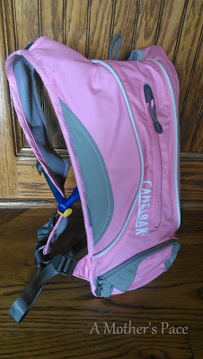
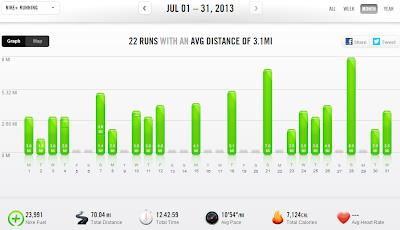

  

  
July seems to have gone by really quickly but I can hardly remember writing my [June in review post](http://bit.ly/15cpLlj). It seems like so long ago. It's been a busy month! We've had two vacations and some fun summertime activities at home. It's crazy that it's only a couple of weeks until we are in full back to school mode. (Can I say that if I have a preschooler??? I'm feeling it already though!)  
  
  
**Racing/Training in July**  
  
Zero races again this month on purpose. I'm not a huge fan of the 5K and I've stopped running them just to run them. Lately I've only wanted to run bigger races like my half marathons coming up in the fall. My training for those has continued throughout July.   
  
Training while on vacation [proved to be a challenge](http://bit.ly/17iPILR) but now I'm back at home and have no excuses for missing training runs!  
  
**Challenges**  
  
The only challenge I officially participated in was the [Runner's World Summer Run Streak](http://bit.ly/17iPZOO). The tail end of the streak was at the beginning of July. I loved running the streak and plan on joining their winter streak as well.  
  
**A Few of my Favorites from A Mother's Pace**  
  
[A Girl from Kansas Running on Hills](http://bit.ly/15cqoLP)  
This was my most popular post of the month. It highlights a few of my hilly runs while traveling. I'm not used to the hills but the variety sure adds to the excitement of running.  
  

  
[Finding the FUN in Running](http://bit.ly/15crqaG)  
Postpartum running has definitely had it's ups and downs for me. In this post I shared a weeks worth of fun running.   
  
[4 Tips for Running in the Rain](http://bit.ly/15crQ0R)  
As long as there is no lightning I don't mind running in the rain. That is, when it is a nice sprinkle. But this run was my least favorite in July for good reason. Not only was it raining but it was a downpour. For all 8 miles.   
  
**Favorite Running Gear**  
  
Almost every run this month I have taken my new [Camelbak Hydration Pack](http://amzn.to/136wbf4). I've even been running with it on my short 3 milers. I found that having water gives me so much more energy while I am out during the summer, even early in the morning. The water makes all my runs easier and, once I got used to it, I prefer to wear the pack instead of carry a handheld.  
  

  
Although this is an affiliate link, I do not receive any compensation for recommending the hydration pack. I just like it and wanted to share it with you.   
  
**Workouts in July**  
  
  

  
Total Running Miles: 70.04  
Treadmill Miles: 0  
Stroller Miles: 3  
Average Pace: 10:54  
  
Total Running Miles for 2013: 214.30  
  
If you are here today anticipating more vacation pictures they will be up tomorrow. The end of the month surprised me and I wanted to get this post up first. I'll be back tomorrow!  
  
  

**What was your favorite/worst workout from July? Do you have a favorite piece of new running gear?**

  
  
  

\-------------------------------------

  

Staying at home with kids sounds easy, right? Life with 3 little ones is busier than I imagined. I don't write every day on the blog but I do update Facebook, Twitter and Instagram more often.   
  
Find A Mother's Pace on...  
  
Twitter [@amotherpace3](https://twitter.com/amotherspace3)  
  
Facebook [http://facebook.com/amotherspace3](http://facebook.com/amotherspace3)   
  
Instagram [amotherspace](http://instagram.com/amotherspace)  
  
RSS [amotherspace](http://feeds.feedburner.com/amotherspace)
