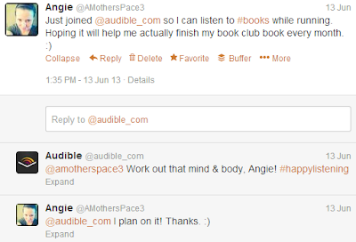
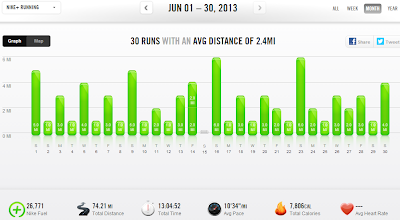

I had a huge first in the month of June. I ran _every single day_ throughout the whole month. It's the first time I've streaked and so it's also my PR!  
  
  

  
My streak will (hopefully!) continue through July 4th. Only a few days left!  
  
**Racing/Training in June**  
  
I didn't race this month but I did start a [new training plan](http://amotherspace.blogspot.com/2013/06/meshing-two-training-plans.html). I'm a run nerd and I really look forward to figuring out training plans for each race that I do. I'm pretty happy with how this one turned out and I'm excited to see what it does for me.  
  
**A few of my favorites from A Mother's Pace**  
[How to Run Faster](http://amotherspace.blogspot.com/2013/06/how-to-run-faster.html)  
By far my most popular post of the month. I guess that people really want to know the secret behind running faster. In this post I shared 3 of my tips for running faster.  
  
[It's Time to Make a Change](http://amotherspace.blogspot.com/2013/06/its-time-to-make-change.html#.Uc0PSvlQGgR)  
This was the post where I admitted that we have been eating out too much lately and my plan to eat at home more often.   
  
[Hot, Hot, Hot](http://amotherspace.blogspot.com/2013/06/hot-hot-hot.html#.Uc0O1vlQGgQ)  
Last week we had a high of 104 degrees here in Wichita. And that's not including the humidity. Saying it's hot is an understatement. In this post I wrote about my top 5 tips for keeping cool in the heat.  
  
  

**Favorite Running Gear**  
This month I joined audible.com and listened to my first audio book while running. I used to listen to books a lot while driving to and from work so I thought I would give it a try while running. My first book was "[The Night Circus](http://amzn.to/1asxtd5)" by Erin Morgenstern. (Affiliate link to The Night Circus book.)  
  

  
I don't have a connection to Audible other than just enjoying their product. It's fun when companies actually interact with you on twitter.  
  
I really enjoyed doing something 'productive' while running. My usual reading time is before bed and it seems lately I just fall asleep too quickly and don't get much reading accomplished.   
  
I loved the narrator of this book and the story itself was very entertaining. I am happy with my first choice from Audible. Now I need to decide what to listen to next!   
  
My only problem was the wind. It's hard for me to hear when it's windy which is not a big deal with music or even a podcast. It makes it a little difficult to follow along with a novel though. A time or two I had to pause it until I turned and the wind wasn't so bad.   
  
**Challenges**  
The challenge I'm participating in this month is the run streak (see above). I've completed 36 days and only have 3 to go. Wahoo!  
  
**Workouts in June**  

That's a whole lotta green! I ran on the 15th too but didn't realize that my watch had the wrong date. It recorded the run in December of 2009. So the averages above are a little off and it's not worth it to call Nike+ to have them change the data.Here are the numbers for June:  
  
Total Running Miles: 75  
Treadmill Miles: 13  
Average Pace: 10:34  
  
Total Running Miles for 2013: 144.38  
  

Have you ever tried an audio book while running? Are you still streaking? What's your mileage for the month?

  
  
  
  

\------------------------------------------

  

  

  
Find A Mother's Pace on...  
  
Twitter [@amotherpace3](https://twitter.com/amotherspace3)  
  
Facebook [http://facebook.com/amotherspace3](http://facebook.com/amotherspace3)   
  
Instagram [amotherspace](http://instagram.com/amotherspace)  
  
RSS [amotherspace](http://feeds.feedburner.com/amotherspace)
