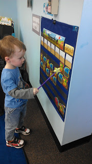
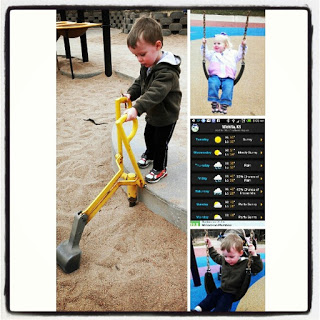
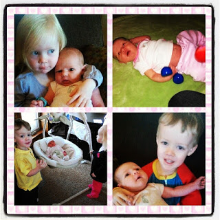

Life is busy these days. Keeping up with a three-year-old and a two-year-old while trying to take care of a newborn who likes to nurse often has been a challenge. Lucky for us it is spring break this week and we have Nana with us all week. Why am I still getting so little accomplished? Oh yeah, it's the nursing, pumping, breast feeding clinic visits, doctor visits, diaper changes, snuggling and playing with my older ones that keeps me busy. Don't get me wrong, I'm not complaining, I just forgot how hectic life can be with a newborn. 

  

It has helped tremendously to have Nana around this week. They have all spent the majority of the time outside enjoying all the construction of new houses in our neighborhood. Seriously, the construction workers now wave and talk to them while they are watching. And they try to watch their language in front of the kids. :) 

  

I've tried to keep life as normal as I can for the kids. We still go to school (when it's not spring break, that is).

  

  

I have taken the kids on errands, although not as much as I used too. We've gone to the park to play. 

  

  

Kansas weather is still trying to decide if it is spring or not. We have snow in the forecast. Boo! I'm so ready for warmer weather! I hope we have actual spring-like weather and it doesn't just skip to super hot summer weather. 

  

The kids really love their little sister. They take great care of her and are always concerned about where she is when they don't see her right away. They love to bring her toys or burp rags, diapers and wipes when I need them. They ask to hold her all the time and I love when Little A says, "I love my baby sister all day." So cute. 

  

  

They are adjusting to the differences too. They've gotten a little better at putting themselves down for a nap on most days. I'm shocked that they can do it because they were so needy during nap time towards the end of my pregnancy. 

  

We are making up a new normal at our house and everyone seems to be doing just fine. I'm proud of the kids and happy that they are doing so well.

  

\--------------------------------------

  

My postpartum plan for exercise hasn't gone like I thought it would at all. I was so excited to get the okay from the doctor to exercise earlier than I had anticipated but my body still isn't quite ready at 3 weeks postpartum. I'm feeling closer though. The main problem is that my legs are now getting so tired. I stand for awhile, shopping, at the park, etc... and I just get worn out. I'm not sure if starting to walk more would help make my legs stronger and less tired or if it would just wipe me out. 

  

We have a big weekend planned because of family coming in town for Little E's baptism but I'm hoping to test out walking next week. 

  

It's also tough to get up early to get exercise in. Being up during the night feeding my Little E makes both parents very tired. I haven't even considered setting an alarm any earlier to wake up for exercise. It will happen when it happens and right now my most important job is being there for my kids, which means getting sleep so I'm not grouchy during the day.

  

\--------------------------------------

  

I'm trying out Instagram! I'm very new to the game but it's fun so far. I'm loving the collages. Follow me [here](http://instagram.com/amotherspace) to see running related pics (eventually) and of course lots of pics of my kiddos.
