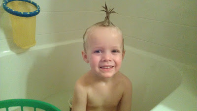
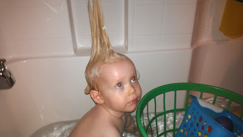
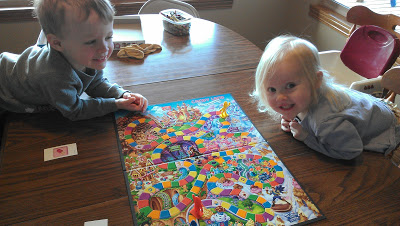
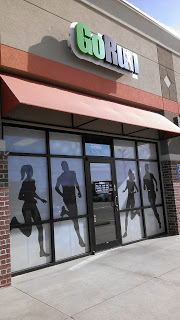
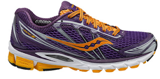
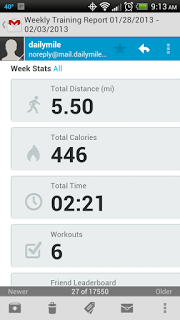

We had a bunch of fun with the kids this week.  
  
There were some mohawks.  
  
  

  

  
A few games of Candy Land.  
  
  

  
And a lot of other undocumented fun.  
  
We headed out to one of our local running stores.  
  
  

  
My husband was buying new shoes. I seriously wanted to buy new shoes. I found these beautiful things.  
  
  

<table align="center" cellpadding="0" cellspacing="0"><tbody><tr><td></td></tr><tr><td><a href="http://www.saucony.com/" target="_blank">www.saucony.com&nbsp;</a></td></tr></tbody></table>

I'm in love. I'm going to try these on once I start running again, just to make sure of the fit of the 5's. I have only worn Saucony's for the past couple of years and I love the fit of the Ride's. I haven't tried on a 5 yet but I have high hopes that they will be wonderful.  
  
Of course, the Super Bowl was this weekend. My evenings are tough lately. I'm tired from being on my feet during the day so I decided to send my family off to a Super Bowl party while I stayed home and rested up for the week. I missed being with friends and family but I really think the rest was good for me.  
  
My husband made these yummy strawberries for the party.  
  
  

  
I decided to walk a bit on the treadmill after they left. Not my best idea. I only made it a mile and I was sore after. My body just can't handle walking in the evenings right now.   
  
So then I snuggled up on the couch and caught up on a couple of my DVR'd shows. Relaxation!  
  
  

<table align="center" cellpadding="0" cellspacing="0"><tbody><tr><td></td></tr><tr><td><a href="http://www.amazon.com/Wild-Found-Pacific-Crest-Oprahs/dp/0307592731/ref=sr_1_1?s=books&amp;ie=UTF8&amp;qid=1360005091&amp;sr=1-1&amp;keywords=wild" target="_blank">Source</a></td></tr></tbody></table>

  
I started reading "Wild" by Cheryl Strayed this week. I'm not that far into it but it's been interesting so far. I had heard about her crazy heavy backpack before I started the book and I just can't believe how unprepared she was for her big hike.   
  
  

  
My workouts this week were o.k. I'm getting slower...again! I completed 5.5 walking miles and two strength training workouts.   
  
I've had a bunch of contractions lately. It's kinda funny, I just had to stop typing for a contraction. Talk about timing! :) They seem to be stronger than they were with either of my other two pregnancies and my doctor says that is normal. My doctor appointment went well again this week. I'm getting closer and closer!  
  
37 Weeks tomorrow!
