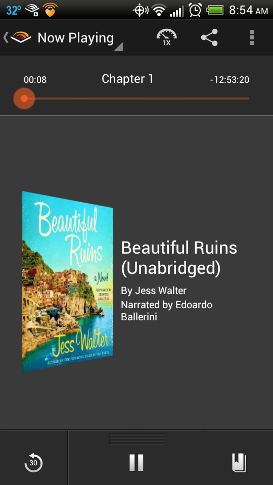
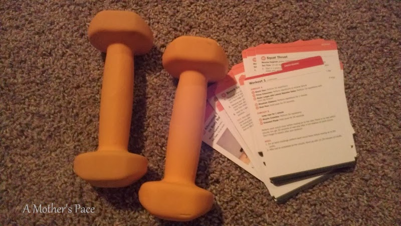
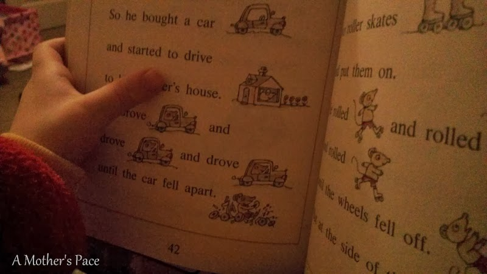
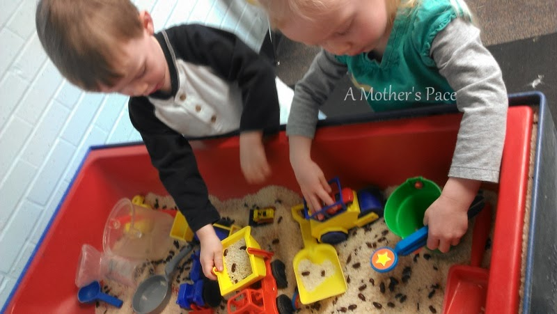

Life lately. Life lately is all about being positive even when it's hard. Here's a look into just a few of the positive things going on in my life right now.  
  
My new book club book is [Beautiful Ruins](http://amzn.to/1b3XV9g). I bought it on Audible and I'm currently listening to it while running. For some reason it is much easier for me to follow along with a book while running outside but I have almost 11 hours left and so I'll have to listen while I'm running on my treadmill as well as outside. I can't wait for it to get lighter outside in the mornings so I can run outside more often.  
  
Oh, the book. I like listening to it because the Italian accents are fun. I'm not really that far into the book but it's a good read, eh, _listen_ so far.  
  
I'm gearing up for my next big training cycle and trying to be better about strength training this go around. Typically I can for sure get it in once a week but now I'm shooting for twice and three times if it's a good week.  
  
One way I'm hoping to make that happen is by putting it on my training calendar and keeping it interesting. I'm trying new routines and moves and will do something different each week.  
  
  

  

This week it was a circuit workout from Jillian Michaels' [Hot Bod in a Box](http://amzn.to/1a7RDeh). What a name for a workout, right?!   
  
The circuit mixed up cardio (treadmill and jumping rope) with weights and body weight strength moves. I finished off the 30 minute circuit with 2 miles of running.  
  
I loved the idea of jumping on and off the treadmill in the middle of a strength workout so I'll come back to these workouts soon.  
  
  

  
My son is really starting to 'get' reading. It's such an exciting process. I love snuggling with him on the couch or in his bed and having HIM read to me.   
  
We are back in the swing of things after the holidays and finally have our first normal week again this week. That means school for everyone. Even Little E enjoys the classes that all of us get to participate in together.  
  
  

  
The rice and bean table is a favorite. My kids would stay over there the whole day if there weren't so many other fun things to do as well.  
  

  
We broke a record on Sunday and had 70 degree temps. In January! Unfortunately, we had to be inside at an event most of the day but we did manage a walk before dinner. The walk was also my warm up for a run. I went for a quick one while my husband fixed dinner for us. (Yes, I have a keeper!)  
  
  

  
Now that we are back in our schedule, this little one doesn't get as many naps in her crib. It seems like one nap a day is usually in the car seat. :/  
  
  

  
  
  

**What's something positive that's happening in your life right now? What are you reading? Do you listen to books?**  

  

\-------------------------------

  

Find A Mother's Pace on...  
  
Twitter [@amotherspace3](https://twitter.com/amotherspace3)  
  
Facebook [amotherspace3](http://facebook.com/amotherspace3)  
  
Instagram [amotherspace](http://instagram.com/amotherspace)  
  
Pinterest [amotherspace](http://pinterest.com/amotherspace/)  
  
Bloglovin' [A Mother's Pace](http://www.bloglovin.com/en/blog/6680087)  
  
RSS [amotherspace](http://feeds.feedburner.com/amotherspace)
