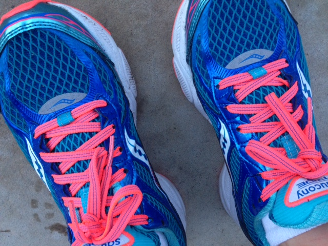
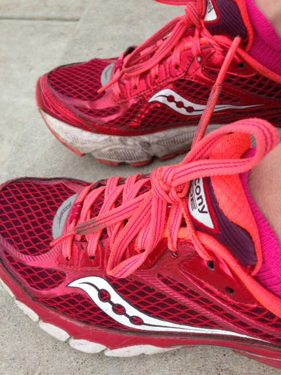

 

Recently I read a post from Paige over at Your Trainer Paige on listening to your body to stay healthy and prevent injury. {Read it ---[here](http://www.yourtrainerpaige.com/2014/10/how-in-the-heck-do-i-listen-to-my-body/)\--- it's a good one!} She said in the article, _"__Nearly every preventable physical ailment starts with a whisper from your body."_ and at first I thought, not mine! Mine shocked me and I was in denial for several days. It happened during a marathon when I decided to keep on running through the pain. I thought it appeared out of nowhere but that's not exactly true.

Sure, the callous on my foot started hurting during the marathon which caused me to change my stride and throw my right side off balance. It stressed my calves, Achilles and foot developing a case of Plantar Fasciitis. But really there was a whisper before the marathon.

Why did I have the callous in the first place?

I think it started back when I bought my last pair of new shoes. My Saucony Ride 7's are wonderful shoes but I'm starting to think that I bought them in a size too small. I've never been one to get blisters on my feet from running, that is, until I bought these shoes. But I'd always ran in these shoes and so I didn't really think about it being _because of the shoes._

 

\[caption id="attachment\_2933" align="aligncenter" width="480"\] These shoes will never be the same after running through all that Gatorade on the Chicago Marathon course. The dirt just sticks to them now!\[/caption\]

 

The blisters eventually became the callouses that I didn't want to do anything to before the marathon. I thought that could be worse because I might get an infection. They weren't painful at all and I thought it would be o.k.

I was recently at a local running store and one of the employees said to me, "Those aren't the shoes you are running in are they?" I said no because they were a retired pair. She said she thought they looked small. They are the same size that I wear now (a half size larger than my normal shoes) but maybe because of all the extra miles (not to mention babies) my foot size has changed.

Why didn't any of this click before I was actually injured?

I wasn't taking the time to listen to the whispers.

Lesson learned. Before I buy my next pair of shoes I will go in and get fitted for the correct size. Unfortunately the two pairs of shoes that I'm rotating right now don't have a lot of mileage on them. I'm not running high mileage now so I'm going to stick with them for awhile before buying a new pair.

 

**Have you been shocked by an injury before?**

**Have you heard the whispers of an injury but kept running anyway?**

 

 

\_\_\_\_\_\_\_\_\_\_\_\_\_\_\_\_\_

I’m running I ran the Chicago Marathon with Team RMHC!

To find out more read my post about [Running for Charity](http://amotherspace.net/2014/06/the-chicago-marathon-running-for-charity/) or head over to my [fundraising page](http://www.kintera.org/faf/donorReg/donorPledge.asp?ievent=1097960&supId=399266070) to make a donation.

——————————-

Find A Mother’s Pace on…

Twitter [@amotherspace3](https://twitter.com/amotherspace3)

Facebook [amotherspace3](http://facebook.com/amotherspace3)

Instagram [amotherspace](http://instagram.com/amotherspace)

Pinterest [amotherspace](http://pinterest.com/amotherspace/)

Bloglovin’ [A Mother’s Pace](http://www.bloglovin.com/en/blog/6680087)

RSS [amotherspace](http://feeds.feedburner.com/amotherspace)
