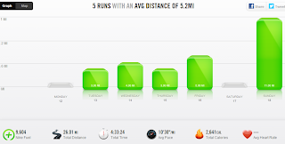

With 11 miles on the schedule for my long run on Sunday, I knew I wanted to help my recovery by spending a little extra time stretching and foam rolling.  
  
The run itself was pretty nice. I ran all the way to the park, then ran around in the park for a little bit before heading back home.   
  
  

  
I'm working on a running fuel post but I wanted to go ahead and write out what I did this weekend because it seemed to work pretty well for me. Before running I had a piece of toast with peanut butter and a glass of Nuun. During my run I ate a packet of Honey Stinger energy chews and I also had a Honey Stinger Gel packet around mile 7. Of course, I also carried my pack with water which I sipped on throughout my run.  
  
Pretty soon after finishing the run I started the [Nike Training Club (NTC) Kara Goucher Pro Stretching Routine](http://bit.ly/18FTMbu). I LOVE doing this after a long run. I can't always spend the 15 minutes to get through it but I can really feel a difference when I make the time to get it done.   
  
Later on in the day I was exhausted. I tried to lay down for awhile but then I realized that my brain wasn't tired but my body was so I broke out the foam roller to try and relax my legs a little. I found a [new rolling routine](http://bit.ly/18FUFRB) and it worked out my legs nicely. My calves are so tight all the time so I definitely love/hate rolling my calves out.   
  
Again, spending just a few minutes rolling out my legs makes all the difference. When I woke up the next morning my calves were not as tight and overall my legs felt great.  
  
  
  

  
**Weekly Workouts**  
  
Monday:  Rest Day, Core Work  
  
Tuesday: 3 miles, Core Work  
  
Wednesday: 4 miles, Core and Upper Body Strength Work  
  
Thursday: 3 miles, Core Work and Lower Body Strength Work  
  
Friday: 5 miles, Core Work  
  
Saturday: 4.99 mile Bike Ride, Core Work  
  
Sunday: 11 miles (long run), Core Work  
  
  

  
Total Running Miles: 26.01  
Weekly Average Pace: 10:30  
  
  

  
August Running Miles: 67.24  
2013 Running Miles: 256.82  
  
Today I am linking up with Jen at [Marathon Mom](http://www.runnershoe.blogspot.com/2013/08/marathon-weekly-and-getting-closer.html) and Meghan at [Little Girl in the Big World](http://www.littlegirlinthebigworld.com/2013/08/finally-100-mile-week.html).  
  
  

**How do you recover after a long run? What do you use to fuel during your run?**

  
  

\------------------------------------------

  

Staying at home with kids sounds easy, right? Life with 3 little ones is busier than I imagined. I don't write every day on the blog but I do update Facebook, Twitter and Instagram more often.   
  
Find A Mother's Pace on...  
  
Twitter [@amotherspace3](https://twitter.com/amotherspace3)  
  
Facebook [amotherspace3](http://facebook.com/amotherspace3)  
  
Instagram [amotherspace](http://instagram.com/amotherspace)  
  
Pinterest [amotherspace](http://pinterest.com/amotherspace/)  
  
Bloglovin' [A Mother's Pace](http://www.bloglovin.com/en/blog/6680087)  
  
RSS [amotherspace](http://feeds.feedburner.com/amotherspace)
