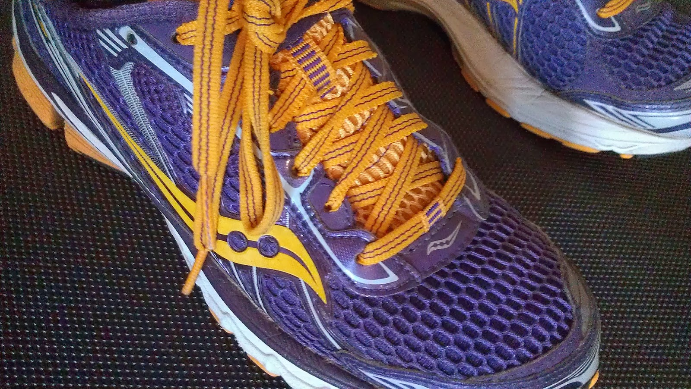

February was a month of cold, snow and the treadmill. In fact, we are supposed to get more snow this weekend. Spring and the early morning sunrises and warmer temps can't come fast enough! I'm hoping it will be warm enough for shorts when my St. Patrick's Day race rolls around...I probably just jinxed myself!  
  
  
**Mothering Moments**  
I think I've mentioned a time or two this week that Little E turned the big ONE! Of course that is her big accomplishment for the month. Oh, and eating cake. She's a rock star when it comes to a smash cake.  
  

  
Little A continues to love dance class. She also loves to fish with her grandpa and they were able to get out for an afternoon of winter fishing recently. I, unfortunately, don't have a picture of the fishing but this ballet picture is pretty adorable.  
  

  
Little O is reading like crazy. He always wants to know what something spells and he does an excellent job of sounding out the letters and figuring it out himself. He loves to read the menus at restaurants, even the (cough, cough) beer menu.  
  

  
**Training in February**  
Training for my 6th half marathon began at the beginning of February. I'm currently at the end of the 4th week of the Own It Plan for a half marathon from the [Train Like a Mother](http://amzn.to/10eETuP) book. This plan is very challenging for me but I really want to own my next half marathon and finally get under that 2 hour mark! Even though it is hard, it is going very well. I'm hitting my paces and getting the miles in.   
  
**14 in 2014 Update**  
  
I didn't run any road races in February. I did participate in a virtual race ([5 by the 5th](http://amotherspace.blogspot.com/2014/02/5-by-5th-february.html#.UxD_KPldVSc)) but I'm still deciding if I want to include virtual races in my 14 in 2014 goal. I'm giving myself a little while before I make that decision. Without virtual races, my race total for the year is a big ONE.  
  

  
**Run This Year Update**  
I've set my sights high this year and I'm attempting to run this year in kilometers. That's 2,014 kilometers in a year or 1,251 miles. I'm sitting at about 288 km for the year so far. It's a tad bit behind what my average should be but my mileage is increasing each week for half marathon training and then it will go way up when I start training for the full marathon in the fall. Unless something else happens, like an injury, I'm still on track to complete this mileage or maybe even more!  

  
  
**Challenges**  
  
I took part in the #bestfoot ab challenge over at Amanda's [Run to the Finish](http://www.runtothefinish.com/) website. I was so excited about this challenge at the beginning of the month. Amanda had put together great core moves and I was very faithful for the first two weeks or so. Then I was off and on until the end of the month. I printed out her calendar and I'll keep it around because it is a great resource.  
  
I also participated in the Move, Nourish, Believe Challenge hosted by Sweat Pink and Lorna Jane. It was three weeks of Instagram fun and you can read those recaps [here](http://amotherspace.blogspot.com/2014/02/move-nourish-believe-challenge-week-1.html), [here](http://amotherspace.blogspot.com/2014/02/move-nourish-believe-challenge-week-2.html#.UxD-u_ldVSc) and [here](http://amotherspace.blogspot.com/2014/02/move-nourish-believe-challenge-week-3.html#.UxD-uPldVSc).  
  
**A Few of My Favorites from A Mother's Pace**  
  
[My Treadmill PDR + My New Favorite Treadmill Running Tip](http://amotherspace.blogspot.com/2014/02/my-treadmill-pdr-my-favorite-new.html#.UxD_EfldVSc)  
I've spent many miles on the treadmill this month and I use a variety of distractions to get me through the miles. I shared my very favorite distraction in this post.  
  

  
  
[Running Through the Years](http://amotherspace.blogspot.com/2014/02/running-through-years.html#.UxD_HPldVSc)  
It's so helpful to look back if only to see how far you've come. In this post I look back at my typical mileage over the years.  
  

  
  
**Favorite Running Gear**  
My two new pairs of shoes! Shoe shopping for running shoes is one of my favorite things to do. This month my two running shoes in rotation were both nearing the 500 mile mark. I ended up buying the Brooks Pure Flows and the Saucony Ride 6's. I'm loving both pairs and I'll do a review of them soon.  
  
**Workouts in January**  
  

  
  
  

Total Running Miles for February: 95.25  
  
Total Running Kilometers for 2014: 288.28  
  
Treadmill Miles: 64  
  
Stroller Miles: Uh, 0. It's freezing outside!  
  
February Average Pace: 9:06  
  
Spin Bike: 2 Sessions: 1 hour, 25 minutes  
  
Strength Training: 14 Sessions: 4 hours, 45 minutes  
  

**Are you trying to Run This Year? How's your mileage? Did you race in February?**

  
  
  

\------------------------------------------

  
Find A Mother's Pace on...  
  
Twitter [@amotherspace3](https://twitter.com/amotherspace3)  
  
Facebook [amotherspace3](http://facebook.com/amotherspace3)  
  
Instagram [amotherspace](http://instagram.com/amotherspace)  
  
Pinterest [amotherspace](http://pinterest.com/amotherspace/)  
  
Bloglovin' [A Mother's Pace](http://www.bloglovin.com/en/blog/6680087)  
  
RSS [amotherspace](http://feeds.feedburner.com/amotherspace)
