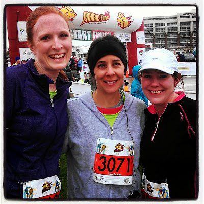
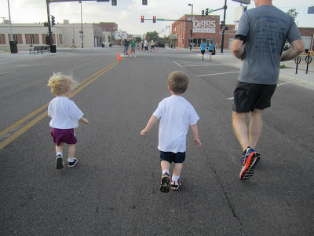
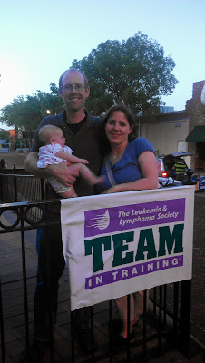
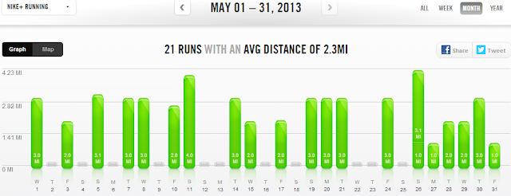

May flew by and here we are in June already. It's time to wrap up the month of May.  
  
  
Racing in May  
  
3 races this month. I ran with friends and family at every race and it definitely made it more enjoyable!   
  
[Wichita Prairie Fire 5K](http://bit.ly/15kCu2G)  
  
  

  
[Get Your Rear in Gear 1 Mile Fun Run](http://bit.ly/15kD40m)  
  
  

  
  
[Get Your Rear in Gear 5K](http://bit.ly/15kDDaz)  
  
  

  
  
Some of my favorites from A Mother's Pace:  
  
It's good (for me) to take a quick look back at posts from the month. Here are some that stuck out to me:  
  
[Music vs. Podcast for Running Entertainment](http://bit.ly/12mmvUh)  
Do you listen to anything while you run? Music, Podcasts, Other? I'm becoming quite a fan of podcasts lately.  
  
[To Stretch or Not to Stretch?](http://bit.ly/12mmyzJ)   
Do you stretch before, during or after a run? There are a lot of opinions out there but I'm leaning towards stretching after I'm finished running.  
  
[Find Your Why](http://bit.ly/12mmCPI)  
Have you ever ran for a charity? I shared my reasons for running with Team in Training in this post.  
  
  

  
  
Favorite Running Gear  
  
It was my birthday this month and so I was pretty lucky to receive some running gifts! I desperately needed a new arm band for my phone so I was pretty happy when I opened [this](http://amzn.to/15vuQTg).  
  
  

  
I've never had a sleeve before so I was hoping that I would like it. I wasn't really prepared for how much I would like it. I really couldn't feel it while running and at one point I completely forgot I had my phone with me. I asked my husband to get his out and take a video of our son running in his first fun run because I thought I had left mine in the stroller. Needless to say it's my favorite running accessory of the month.   
  
Challenges  
  
I'm participating in the Runner's World Summer Run Streak and it's going well so far. 5 days completed in May and it runs until July 4th. #RWRunStreak  
  
  

  
  
Workouts in May  
  
Running, running and more running!   
  
  

  
  
In May of 2012 I ran 75 miles. I had just finished training for a half-marathon so it was all just maintenance miles.   
  
May of 2013 I am just really getting back into running after my pregnancy break. I'm not officially training for anything but I am trying to increase my base before training starts in just a few short weeks. I'm pretty happy with my mileage for this month!  
  
I'm loving running outside right now so even though I'm very grateful that we have a treadmill it's o.k. that it's collecting a little dust this month.  
  
I'm currently 3 months postpartum and slowly, slowly the running is getting a little easier. My pace is still slower than I would like it but I'm carrying 17 extra pounds and I'm sure that makes a difference.   
  

Here are the numbers for May:  
  
Total Running Miles: 53.38  
Treadmill Miles: 2  
Total Walking Miles: 11  
  
Total Running Miles for 2013: 87.38  
  
  
  

**What was your mileage for May? Did you race in May? Are you streaking with Runner's World?**

  
  
  
  

\------------------------------------------

  

  
Find A Mother's Pace on...  
  
Twitter [@amotherpace3](https://twitter.com/amotherspace3)  
  
Facebook [http://facebook.com/amotherspace3](http://facebook.com/amotherspace3)   
  
Instagram [amotherspace](http://instagram.com/amotherspace)  
  
RSS [amotherspace](http://feeds.feedburner.com/amotherspace)
