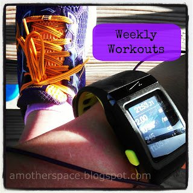

Yesterday I finally took a few minutes to figure out what my half marathon training plan is going to be this time around. Just in time too because my training officially started today with 3 miles this morning.  
  
I ended up meshing two plans together. I used Hal Higdon's [Novice 2 plan](http://bit.ly/13jrgcW) for the mileage and I used the [Finish It plan](http://bit.ly/16t7Sfo) from [Train Like a Mother](http://amzn.to/10eETuP) (by Sarah Bowen Shea and Dimity McDowell) to add in strides and speed work.  
  
I'm pretty excited about this plan but I'm nervous about it too. The strides (up to 10 at the end) and the speed work will be tough. While postpartum running has been difficult, I'm ready to really get back into running and this plan will help me.  
  
**Runner's World Summer Run Streak Update**  
  
  

  
And the streaking continues. Day 29 was this morning. The rest day 1 milers are still pretty fun. I'm not burned out on running and the end is in sight. It might feel weird to _not_ run for a day after this streak is over.  
  

  
**Weekly Workouts**  
  
Monday: 1 mile run (10:17 pace), Strength Training  
  
Tuesday: 3 mile run (10:15 pace), Core Work  
  
Wednesday: 1 mile run (9:25 pace), Strength Training  
  
Thursday: 3 mile run (11:23 pace), Core Work  
  
Friday: 2 mile run (10:17 pace), Strength Training  
  
Saturday: 1 mile run (8:30 pace)  
  
Sunday: 6 mile run (11:23 pace)  
  
  

  
Total Running Miles: 17  
Weekly Average Pace: 10:42  
  
June Running Miles: 59  
2013 Running Miles: 128.38   
  
  

  
  

**Are you racing in the fall? Have you started your training plan already? What plan do you use?**

  

  
  
  
  

\------------------------------------------

  

  
Find A Mother's Pace on...  
  
Twitter [@amotherpace3](https://twitter.com/amotherspace3)  
  
Facebook [http://facebook.com/amotherspace3](http://facebook.com/amotherspace3)   
  
Instagram [amotherspace](http://instagram.com/amotherspace)  
  
RSS [amotherspace](http://feeds.feedburner.com/amotherspace)
