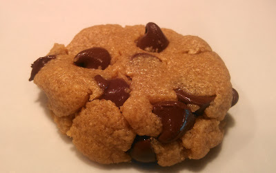

One of the main reasons why I blog about running is the fact that it motivates me to keep on running. Some days when I don't want to get out and run (yes, that happens to me!) I think about the big 0 that would be on my training log for the week. Most days that's all it takes to get me out the door or down to the treadmill.   
  
I'm starting to see meal planning the same way. If I blog about it, then the meal plan _should_ be ready by Sunday, right?  
  
We've been doing o.k. with planning out meals but taking the time to do it during the week for the up and coming week will help out a lot.  
  
Here are some of the things we've been enjoying throughout the last week.  
  
\[breakfast\]  
My go-to first meal of the day is organic vanilla yogurt with homemade granola, a little orange juice and a cup of coffee.   
  
  

  
  
\[lunch\]  
I've been eating a lot of salads for lunch lately. I pile whatever we have in the fridge on the lettuce for a healthy option at my midday meal. The salad below has turkey, zucchini, bacon, black beans and blanched carrots. Topped with a homemade Italian dressing.  
  
  

  
\[dinner\]  
It's been too long since I made this Black Bean Enchilada Casserole. It's easy and with homemade enchilada sauce and brown rice, it's pretty healthy too.  
  
  

  
  
\[treat\]  
I saw these [4 ingredient peanut butter chocolate chip cookies](http://www.gimmesomeoven.com/4-ingredient-peanut-butter-chocolate-chip-cookies-recipe/) the other day and literally made them a few minutes later. They are so easy that they are dangerous!   
  
  

  
\[baby food\]  
With my first two children we made almost all of the baby food that they consumed. This time around the convenience of the organic food at the store has won and we've been buying most of it. (It pains me to admit that, just keeping it real!) Now that Little E is eating more food, we are starting to give her more table food. I specifically made these blanched carrots so that we could cut them up and give them to Little E.   
  
  

  
Here's what we are planning for this week.  
  
Monday: Penne with Bacon, Peas and Lemon from [What Chefs Feed Their Kids](http://amzn.to/1cIU8Ss) by Fanae Aaron  
Tuesday: Sweet Potato and Black Bean Tacos  
Wednesday: Leftovers  
Thursday: Vegan Night: Nutty Tofu and Veggies  
Friday: Cheeseburger Skillet Pie  
Saturday: Leftovers  
Sunday: Easy Veggie Soup  
  
Updated to add: I'm also linking up with [WIAW](http://www.peasandcrayons.com/2013/12/what-i-ate-wednesday-152.html) this week.   
  
  

**What are you eating this week? What was your favorite meal from last week? Do you menu plan?**

\-------------------------------

  

Find A Mother's Pace on...  
  
Twitter [@amotherspace3](https://twitter.com/amotherspace3)  
  
Facebook [amotherspace3](http://facebook.com/amotherspace3)  
  
Instagram [amotherspace](http://instagram.com/amotherspace)  
  
Pinterest [amotherspace](http://pinterest.com/amotherspace/)  
  
Bloglovin' [A Mother's Pace](http://www.bloglovin.com/en/blog/6680087)  
  
RSS [amotherspace](http://feeds.feedburner.com/amotherspace)
