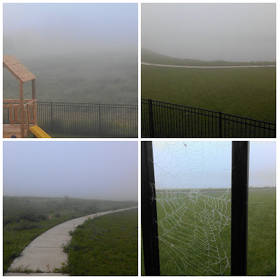
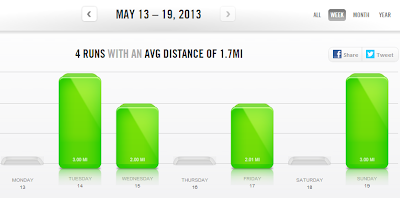

One word to describe my running last week: unmotivated. Every run was tough. I gave up early on runs. Twice I ended up talking myself out of the entire 3 miles I was aiming for. 

  
Maybe it was my allergies. They hit me hard last week. Maybe it was the crazy dense fog we had one morning. It made it tough to breathe.   
  
  

  
This fog was so thick that I couldn't see around the lake. It was eerie, usually there are houses all around on this path but I couldn't see anything and felt very much alone. And then I came upon the sprinklers. Usually when the sprinklers are running I take another route. It's hard to avoid them and I end up getting soaked. Because the fog was so thick I didn't realize I needed to avoid the route and it was too late once I was almost literally on top of them. The grass is too muddy so I just ran right through them. Not very fun when it is chilly out and so humid that nothing evaporated during the rest of my run.  
  
Anyway...  
  
I'm happy to say that [being around runners](http://bit.ly/14K7eZX) on Thursday evening helped and my run over the weekend was much better. Hearing about training plans and knowing that my mileage is about to increase made me excited to get back out with a good run. I felt (and still feel) motivated again!  
  
Here's a look at my running workouts from last week.  
  
  

  
  
Monday  
Evening Family Walk  
  
Tuesday  
3 Mile Run with Strides  
  
Wednesday  
2 Mile Run  
  
Thursday  
Rest  
  
Friday  
2 Mile Run  
  
Saturday  
Rest  
  
Sunday  
3 Mile Run  
  
  

**Are you training for a race right now? Do you make up your own training plan? If not, where do you find your training plans?** 

  
  
  

\------------------------------------------

  

  
Find A Mother's Pace on...  
  
Twitter [@amotherpace3](https://twitter.com/amotherspace3)  
  
Facebook [http://facebook.com/amotherspace3](http://facebook.com/amotherspace3)   
  
Instagram [amotherspace](http://instagram.com/amotherspace)  
  
RSS [amotherspace](http://feeds.feedburner.com/amotherspace)
