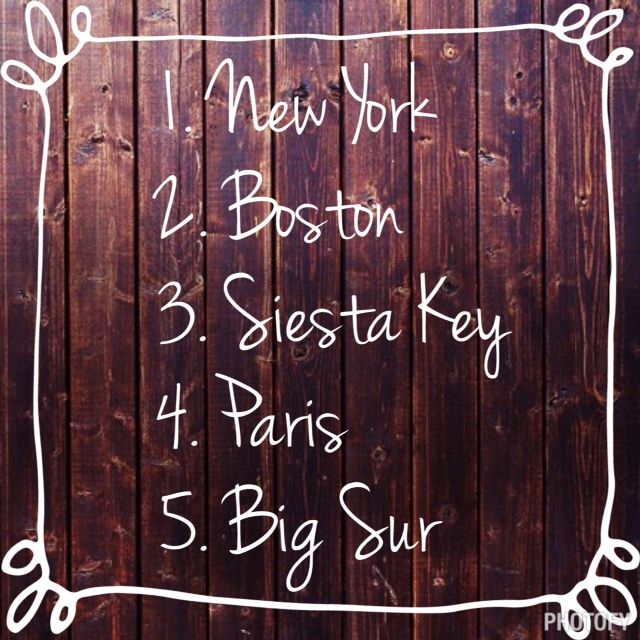

Recently on Instagram I was tagged to list my five favorite dream races. Because I've given this so much thought I barely had to think about it before putting my list out there.

I'm happy to say that my number one dream race has already been accomplished. The Chicago Marathon was at the top of the list and it was crossed off in October.

I'm in no rush to run another marathon (I'm waiting until the kids are a little older!)  but the key word in this activity was DREAM. These are the races that if the stars aligned I would love to one day experience!

 

 

\[one\] **New York City**

New York is the marathon that I see as possibly my next big marathon I try to enter. Especially after running Chicago last year, I'm sure that New York is one big party on marathon day just like Chicago. I love traveling to New York and running in Central Park and this would be a unique way to see all five boroughs on foot.

\[two\] **Boston**

In order to run Boston I would have to get super speedy, train hard and qualify first with a 42 minute PR. Then I would have to get accepted. It's not that it's out of the question (I set a PR by 40 minutes in Chicago) but it's definitely something that would take dedication and hard work. So, I'm not chasing this dream any time soon, if at all, but it is on the list.

\[three\] **Siesta Key**

Siesta Key, Florida is heaven on earth and to run this half marathon in such a beautiful location would make it all the more special for me. And as a bonus I could eat crab legs at Captain Curt's as my post race meal!

\[four\] **Paris**

Visiting Paris has been a dream of mine even before I started running races. So it's not surprising at all that the Paris Marathon is on my list. I've always wanted to photograph the bridges on the Seine River and this trip would cover both of these bucket list items.

\[five\] **Big Sur**

I've heard that this is one of the most breathtaking courses in our country and I hope to find out one day just how beautiful it is. I think this would be a race to enter with no time goal so that I could just soak up the scenery and enjoy the race.

_**Confession:**_ I hate to fly. On my last flight home from New York City probably 3.5 years ago I had a panic attack and just about lost it. I used to fly all the time and had no problem with it at all. Maybe it has something to do with having children??? But after that flight I am scared to get on a plane and have it happen again. It was horrible.

See the problem with my dream races above? I live in Kansas and it would be a pain (if not impossible) to drive to all of these places. Just one of the reasons why traveling to a race is a challenge for me but I'm sure I'll have to be on an airplane at some point anyway. Ugh, just thinking about it makes my palms sweat...

 

**What are your dream races? Anyone else afraid to fly?**

\[bctt tweet="My 5 dream races. What would you add to the list?  http://wp.me/p4oSeG-NV via @amotherspace3 #runchat"\]

——————————-

Find A Mother’s Pace on…

Twitter [@amotherspace3](https://twitter.com/amotherspace3)

Facebook [amotherspace3](http://facebook.com/amotherspace3)

Instagram [amotherspace](http://instagram.com/amotherspace)

Pinterest [amotherspace](http://pinterest.com/amotherspace/)

Bloglovin’ [A Mother’s Pace](http://www.bloglovin.com/en/blog/6680087)

RSS [amotherspace](http://feeds.feedburner.com/amotherspace)
