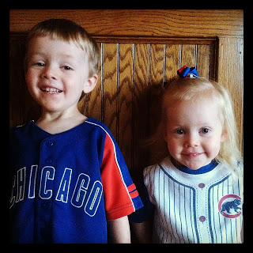
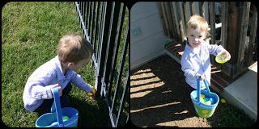
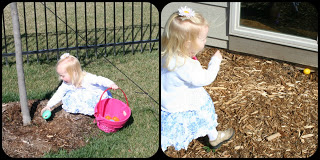
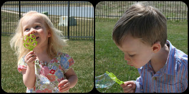
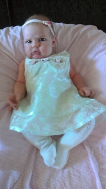
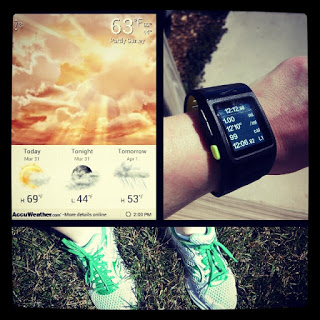

I love, love, love that achy leg feeling you get the day after a run, especially when it is a hard workout or you haven't ran for awhile. But I'm getting ahead of myself...  
  
It's Opening Day today!   
  
  

  
My kids are excited to wear their 'Go Go Ball' shirts. Go Cubs, Go!   
  
  
Yesterday was a beautiful Easter Sunday. We enjoyed our church celebration and then headed home for an egg hunt and some bubble time.   
  

  

  

  

  
It was such a beautiful day that it was hard to pass up the chance to go for a run. Yes, after a long break from running, I am back!   
  
  

<table align="center" cellpadding="0" cellspacing="0"><tbody><tr><td></td></tr><tr><td><a href="http://instagram.com/amotherspace" target="_blank">Follow me on Instagram</a></td></tr></tbody></table>

My first postpartum run was amazing and I'm so glad that I decided just to go for it and run. Before I started running I had no idea what I was going to do. Run/walk or just run a little and then finish up with a walk. It had been so long since my last run that I was a little nervous and I wasn't sure how it would feel. I decided to listen to my body to figure out what would be the best. I ended up running for a mile and then walking a cool down mile.   
  
My running mile started out great. I was excited to be running again after almost a 4 month pregnancy break. I was wondering why I had put off running for so long. It felt great. It gave me energy. I was running!  
  
Then I hit 2 1/2 minutes. Yes, it only took 2.5 minutes for the Kansas wind and my out of shape body to make me go Whoa...I am running again and it is tough!  
  
I kept at it and lasted a mile. A long, slow mile but it is still a mile. Today I woke up with slightly sore legs that made me smile. I can't wait to get out there again for some more miles.
