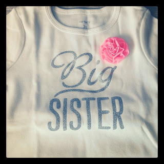
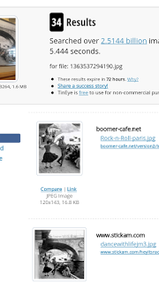
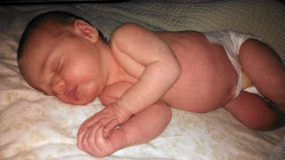

1\. Today I stumbled upon a Big Sister shirt. I had looked everywhere for one before our baby was born but had no luck. Yesterday I found this at Carter's.

  

  

So cute and only $7.00! I couldn't resist. 

  

2\. I saw this photo at Red Robin on Sunday and loved it. 

  

  

I thought it was taken in Paris but my husband disagreed. He found a website that looks up images and gives you information about them. We loaded the image up to tineye.com and within seconds we had 34 results and a ton of information. 

  

  

This 'Rock n Roll' photo was taken in Paris. I do know my Paris bridges. :)

  

3\. One of the joys of breastfeeding is having to pump occasionally. (TMI??? Sorry!) I typically do it for 20 minutes twice a day. I either blog, check social media or watch something on Netflix to pass the time. Lately I've been watching Glee which I just started a few weeks ago. I'm still on Season 1 and saw the 'Single Ladies' performance a couple of days ago. I CAN'T get the song out of my head.

  
4\. Tilapia Tacos are on the menu for tonight. It is one of my favorite recipes and my mouth is watering just thinking about it. Can't wait until dinner time!  
You can find my recipe [here](http://www.tasteofhome.com/recipes/Tilapia-Tostadas).  
  
5\. I can't seem to leave out a sleeping baby picture. So adorable!  
  
  

