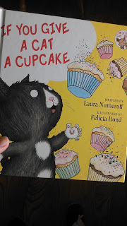
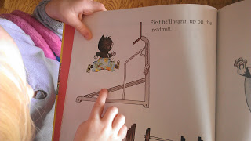
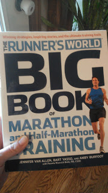
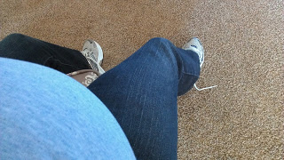
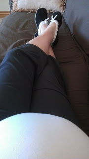
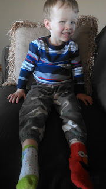

Happy Friday!  
  
1. 
  
When reading this book:  
  
  

  
My daughter always says "That's like you on the treadmill!" when she sees this picture:  
  
  

  
Yes, I look just like that cat, especially with my 37th week belly!  
  
  
2. 
  
This much anticipated book arrived this week.   
  
  

  
I'm going to take advantage of my non-running pregnant/postpartum time to get ready for building a base and training for my fall half marathon.  
  
  
3. 
  
It's getting harder to reach down and tie my shoes. Luckily my husband is around a lot.   
  
  

  
4. 
  
I seriously considered wearing my slippers to my OB appt. this week. (See #3) In the end I decided to put on the shoes.  
  

  
5. 
  
And this is the best looking mismatched boy around. He picked out his clothes for the day and I decided it wasn't a battle worth fighting. :) And we even went out in public!  
  

