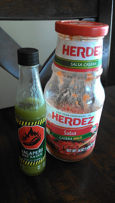
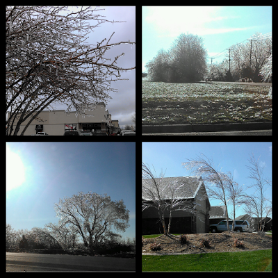

1\. My Runner's World magazine finally arrived yesterday. I've been hearing so many things about it this month that I was anxiously awaiting it.   
  

  
2\. I'll be watching the Boston Marathon on Monday. I can't wait to see how Kara and Shalane do. I've loved listening to podcasts and watching the Google+ hangouts leading up to the marathon. Those two are both fantastic!  
  
3\. I'm a little addicted to salsa right now.  
  

  
I'm not sure why because I have always liked it but right now I LOVE it. I could eat Mexican food every night. I found this recipe for [Crockpot Enchilada Casserole](http://www.theleangreenbean.com/crockpot-enchilada-casserole/) that looks delicious. We'll be having that next week.  
  
4\. We had a crazy ice storm here in Kansas this week. Not only because it happened in APRIL (where is spring this year, anyway???) but because there was so much ice. I didn't realize how bad it was until driving around later in the day. So many trees were damaged. I saw several huge trees that were split down the middle and even one that was uprooted. It was beautiful though. The sun was shining just perfectly on our drive to school Thursday morning. The trees sparkled, I've never seen anything like it before. The pictures don't really do it justice, but I tried.  
  

  
5\. This little girl turned 6 weeks old this week. 6 weeks!  
  

