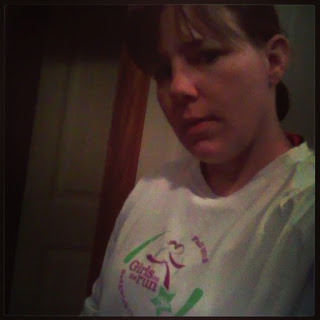

This week has been an emotional one. I'm dedicating my five this week to Boston.

  
1\. I've read so many accounts of personal experiences on blogs this week. Here are some of the ones that really stood out to me.  
  
Ali shared her Post-Boston Thoughts [**here**](http://mileswithstyle.com/2013/04/15/post-boston-thoughts/).  
  
MegRunnerGirl shared her personal account of the day through her race report [**here**](http://megrunnergirl.com/2013/04/16/race-report-2013-boston-marathon/).  
  
Dimity shared her thoughts on becoming Undone [**here**](http://anothermotherrunner.com/2013/04/15/undonebostonmarathon/).  
  
Pavement Runner shared his thoughts through Love. Strength. Boston. [**here**](http://pavementrunner.com/love-strength-boston/).  
  
Thank you to the above bloggers for sharing your thoughts on such an emotional day.  
  
  
2\. This quote by Kathrine Switzer takes on new meaning after Monday.   
['If you are losing faith in human nature, go out and watch a marathon'](http://www.washingtonpost.com/blogs/wonkblog/wp/2013/04/15/if-you-are-losing-faith-in-human-nature-go-out-and-watch-a-marathon/) posted by Ezra Klein  
  
  
3\. Spectators are amazing. I agree with so much of what Ryan wrote.  
[The People Who Watch Marathons](http://jezebel.com/the-people-who-watch-marathons-473405924) by Erin Gloria Ryan  
  
  
4\. I'm amazed by how running communities have pulled together to raise funds for the injured people. Follow this [**link**](http://anothermotherrunner.com/2013/04/16/10-ways-to-support-boston/) to find 10 Ways to Support Boston.  
  
  
5\. And finally, [the intro from the Colbert Report.](http://www.colbertnation.com/the-colbert-report-videos/425527/april-16-2013/intro---4-16-13) I heard it was funny and until I watched it I couldn't imagine something being 'funny' in relation to the Boston Marathon. Definitely worth watching.  
  
  
  

<table align="center" cellpadding="0" cellspacing="0"><tbody><tr><td></td></tr><tr><td>Wearing a race shirt before my morning run on Tuesday.</td></tr></tbody></table>
