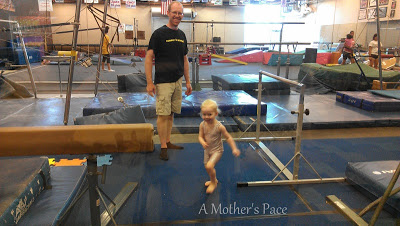
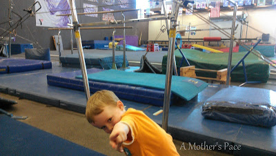
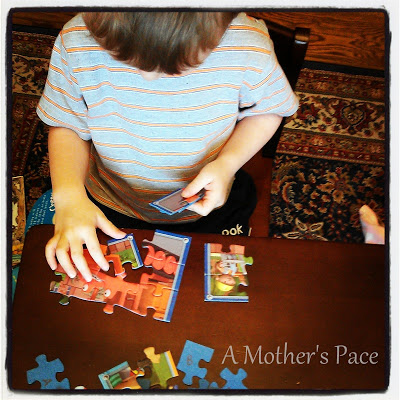
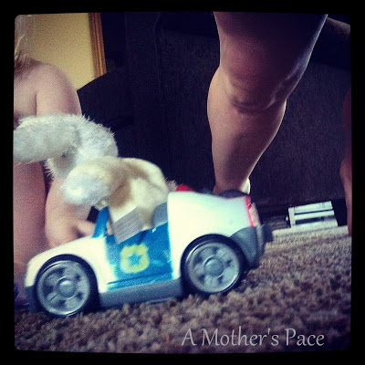

It's been a few weeks since I've shared a 'Five' post so I thought I'd catch you up on what we've been doing lately.  
  
1\. We're back at gymnastics.   
  
  

  

  

It's been awhile. I realized that we haven't signed up for a class since Little E was born. The last time I sat and watched them I was very, very pregnant. That was over 5 months ago.

  

2\. The weather has been crazy stormy and rainy lately. Even though I'm not minding the treadmill right now, I'm still completely missing running in nice weather. The humidity is super high. It's raining and lightning all the time. I'm ready for normal summer weather!

  

  
3\. Rain means we are indoors a lot. My kids play well together, most of the time. We've been getting out toys that have been away in the closet and they feel like brand new again!  
  

  
4\. As a mom who exercises around her children I never know what to expect during my workout. My plank was recently a bridge for a police officer bunny.  
(I love that there is a camera on my phone. There is no way I would ever capture pictures like these without it!)  
  

  
5\. My sweet girlie is teething and really into cuddling right now. No complaints from me that she wants to be rocked to sleep again!  
  

  
Most of these photos are from my Instagram account. Click [here](http://instagram.com/amotherspace) to see more pictures of running, family, food and other random things happening in my life.  
  
Happy Friday! Enjoy your weekend!  
  
  

\------------------------------------------

  

Staying at home with kids sounds easy, right? Life with 3 little ones is busier than I imagined. I don't write every day on the blog but I do update Facebook, Twitter and Instagram more often.   
  
Find A Mother's Pace on...  
  
Twitter [@amotherspace3](https://twitter.com/amotherspace3)  
  
Facebook [amotherspace3](http://facebook.com/amotherspace3)  
  
Instagram [amotherspace](http://instagram.com/amotherspace)  
  
Pinterest [amotherspace](http://pinterest.com/amotherspace/)  
  
RSS [amotherspace](http://feeds.feedburner.com/amotherspace)
