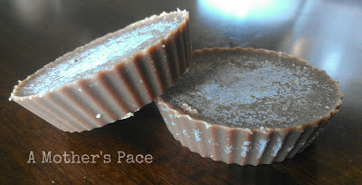
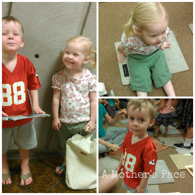
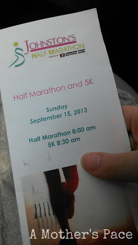
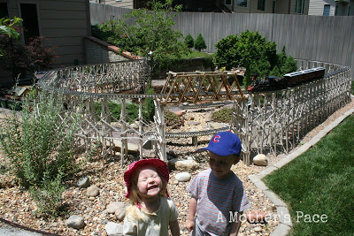
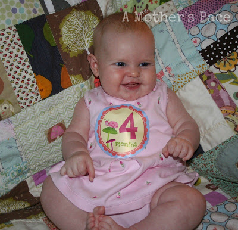

1\. I have quite a sweet tooth and this [little recipe](http://bit.ly/1ajkgU1) is saving me some major calories.  

  
O.K., so I'm not a food blogger. The chocolates don't look the best but they _are_ the best! Easy to make, delicious, sorta healthy, what's not to like?  
  
Sure they are full of calories too but it is all 'real food' and much better than folding to an afternoon snack of ice cream. One bite of this chocolate after lunch and again after dinner has been keeping my chocolate cravings at bay.  
  
2\. Summer time Nursery Rhyme Time at the library has resumed. We had to miss during the winter because we had school on the same day. Now we're free to enjoy the songs, books and fingerplays each week.  
  
  

  
3\. I'm happy that I'm the type of person to be on this kind of mailing list.  
  
  

  
I'm doing two other half marathons this fall so I'm not able to run this particular half but it still makes me happy to get it in the mail.  
  
4\. Our neighbor has this in his backyard.  
  
  

  
He recently had us over to check it out and the kids loved it. Of course they would, trains are their favorite toys!  
  
5\. Little E is now 4 months old!   
  
  

  
She's smiling, laughing and has rolled over a couple of times. I'm not sure how but her clothes right now are sized anywhere in between 3 months and 9 months. Such a precious little girl!  
  

**Do you have a sweet tooth? How do you keep from caving?**

  
  
  
  

\------------------------------------------

  

  
Find A Mother's Pace on...  
  
Twitter [@amotherpace3](https://twitter.com/amotherspace3)  
  
Facebook [http://facebook.com/amotherspace3](http://facebook.com/amotherspace3)   
  
Instagram [amotherspace](http://instagram.com/amotherspace)  
  
RSS [amotherspace](http://feeds.feedburner.com/amotherspace)
