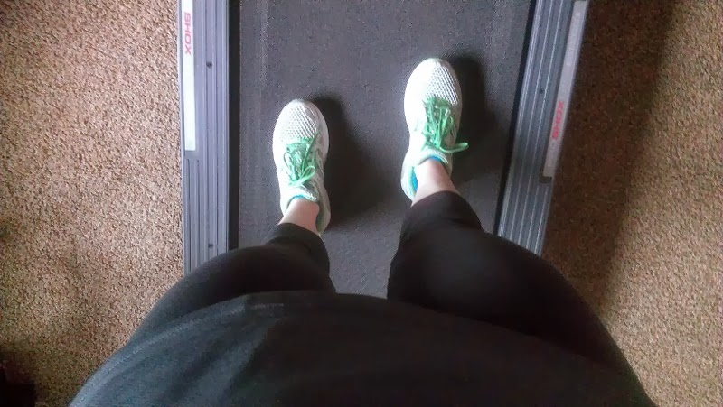
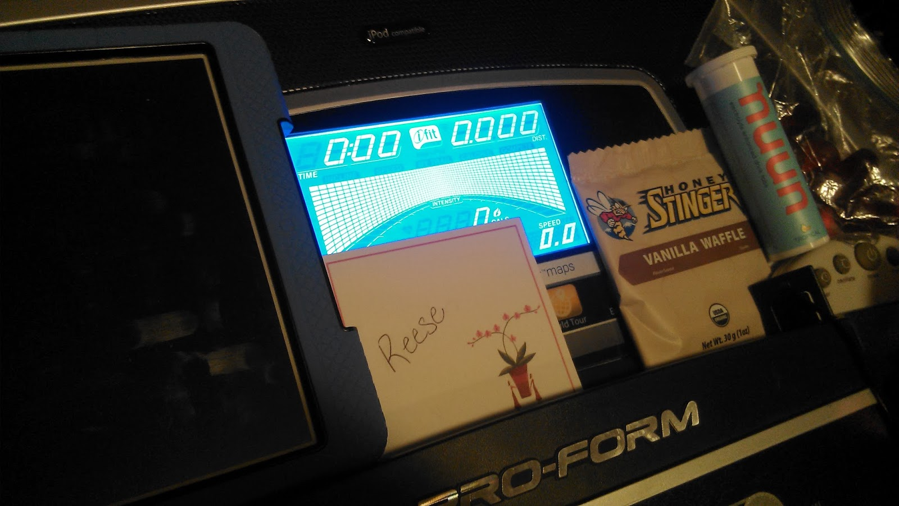
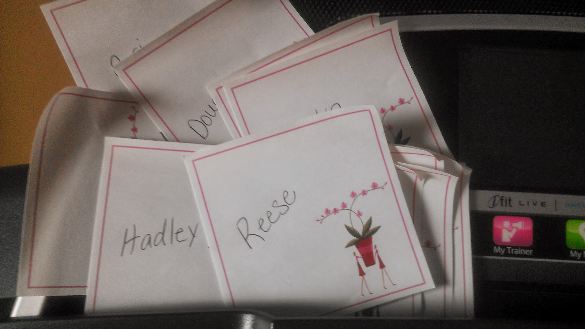
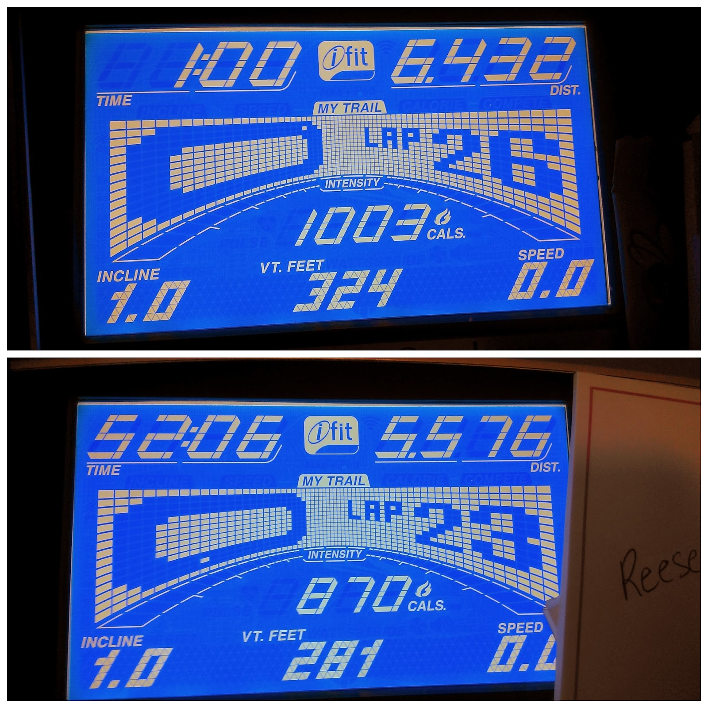

My daughter's first birthday was this week and we had her party last Sunday. We had family in town and a busy day of activities scheduled on both Saturday and Sunday.   
  
  

  
I knew I needed to get in a tough 12 mile run at some point but I wasn't quite sure how that was going to happen. Finally I decided that the easiest way would be to wake up super early and just get it done.  
  
  

  
Easier said than done when you have family in town and are up late the night before.   
  
But I did it. I set my alarm for 5:00, ignored the snooze button and got out of bed. I got ready and then headed down to the treadmill. I don't like running alone in the dark so lately all my early morning running has been done on the treadmill.  
  
The treadmill has been tough lately, mentally. Sometimes an easy 3 mile run can feel like FOREVER. But this run was a little different. I knew I had to get in 12 miles and I knew I couldn't cut it short.   
  
  

  
I needed a plan and I remembered back to some treadmill tips from my treadmill runner hero, [RunEMZ](http://www.runemz.com/). She recently ran 100 miles on a treadmill in less than 24 hours to raise money for charity! Pretty much anything she suggests about treadmill running, I take seriously. She inspires me daily on [Instagram](http://instagram.com/runemz), so go follow her if you don't already.  
  

  
I read somewhere (I really wish I could remember where!) that to get through long miles RunEMZ sometimes puts names on post-its and dedicates miles to people. This turned out to be the perfect motivation for my run on Saturday.  
  
  

  
I filled out the post-its the night before and dedicated a mile to someone that I know that has been or is currently struggling with cancer. 12 miles and 12 names. It's very sad to me that I can come up with a list like that easily.   
  
I'm not going to say that the run was easy. Before this the longest run on the treadmill that I have accomplished was 9 miles. These 12 miles were challenging but they did go by very quickly for me. Every time doubt would creep into my head as to whether or not I thought I could finish the run I would just glance down at a name. Just thinking about that person...my niece, a good friend, a mother of 10 that just found out she has cancer for the second time...just thinking about these people and more pushed me to finish out the mile I was running.  
  
My training called for 12 miles with 4 at race pace. I warmed up with the treadmill set to 6.3 (~9:30 pace) and then bumped it up to 6.6-6.7 (~9:05-8:57 pace) for 4 miles at 'race pace.' I wrapped up the run with the last 4 miles at around a 9:30 pace.   
  
  

  
I finished the run in 1:52:06 with an average pace of 9:20. Last time I ran 9 miles on my treadmill it shut off at some point. Either I had reached a certain distance or time cap and the thing powered off. To avoid that this time around I stopped it at 1 hour to reset the clock and miles.   
  
The benefit of running on the treadmill is I don't have to worry about missing a pace goal. I just set the treadmill and run. I know it's not the ideal way to pace a run but it definitely works when it's needed.  
  
I was tempted to keep running and just get in 13.1. Crazy, I know, but I'm so close now I know I want to accomplish a half marathon on the mill at some point.   
  
  

**What is your treadmill PDR (personal distance record)? What secrets do you have for getting in long miles on the treadmill?**

  
  
  

\-------------------------------

  

Find A Mother's Pace on...  
  
Twitter [@amotherspace3](https://twitter.com/amotherspace3)  
  
Facebook [amotherspace3](http://facebook.com/amotherspace3)  
  
Instagram [amotherspace](http://instagram.com/amotherspace)  
  
Pinterest [amotherspace](http://pinterest.com/amotherspace/)  
  
Bloglovin' [A Mother's Pace](http://www.bloglovin.com/en/blog/6680087)  
  
RSS [amotherspace](http://feeds.feedburner.com/amotherspace)
