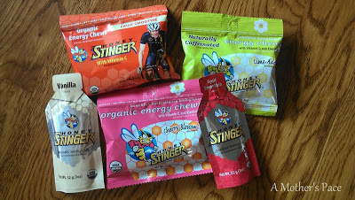
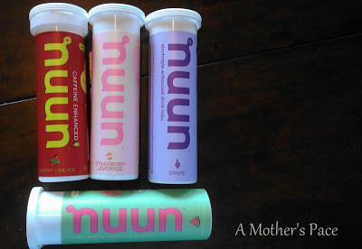
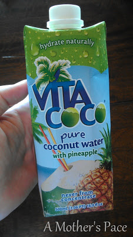

During this round of half marathon training I am determined to change my fueling habits during running, especially the long runs.  
  
Now that my weekend running is up in the double digits I've been playing around with new things and attempting to find out what will work well for me on race day.  
  
My fueling before was typical for most runners and included Gu, Gatorade and water. Lately I've been focusing on cutting out processed food and so the above combination isn't going to work for me anymore. I know the following products are not perfect but they are a step in the right direction.   
  
The first new products I am using are from the Honey Stinger line.  
  
  

  
_Oh, and now might be a good time to let you know that this is not a sponsored post. I've purchased all of these products on my own and I am enjoying them right now. I am not receiving any compensation from the companies. That said, this post does contain affiliate links._ _If you click on them to find out more info or purchase items you will be supporting my blog._  
  
I've never eaten chews while running before and I'm surprised at how much I love them. I've tried all three of the flavors above ([Fruit Smoothie](http://amzn.to/1aRlczq), [Limeade](http://amzn.to/17mjjcx) and [Cherry Blossom](http://amzn.to/16TytDF)) and can't pick a favorite flavor. They were all good and refreshing to eat while running. I've been snacking on one package during all my double digit runs lately and basically eating the entire package in thirds throughout my run. They seem to help my energy level and keep me going for the longer miles.  
  
I'm still trying to figure out how to eat these and keep on running though. I've been putting them in a baggie and getting them out of my hydration pack but I have to slow down or walk to do it. This weekend I'm going to wear my shorts with pockets and divide the chews into thirds beforehand. I'm hoping this makes them easier to grab and will allow me to keep running. **Any other tips on how to do this?**  
Also pictured above are the Honey Stinger energy gels. So far I've had two of these. During my last 11 mile run I forgot to take a gel and I bonked big time at the end. The next 12 mile run I remembered to take the gel and made it through feeling much better. I enjoyed both but I did prefer the [Vanilla](http://amzn.to/14bgyVA) over the [Fruit Smoothie](http://amzn.to/187lRrz). They were both good but the vanilla was _really good_.   
  
Now on to hydration.  
  
I've been running long with my hydration pack filled with water. I've heard of people putting Nuun in their pack but I haven't been brave enough to try it yet because I'm concerned that I would miss water during my run. So instead I'm drinking some electrolytes before my run.  
  
  

  
I have been enjoying the [Watermelon](http://amzn.to/16TCEPD), [Strawberry Lemonade](http://amzn.to/14GR6v0), and [Grape](http://amzn.to/142wgrs) flavors so far and I'm going to try the [Cherry Limeade](http://amzn.to/1dqihyH) soon. So far if I had to pick a favorite it would be Watermelon followed closely by the Strawberry Lemonade.   
  
There are also a few things that I'm curious about but haven't tried yet. The first is raisins instead of chews. Definitely a more natural choice but I need to try it and make sure that they gives me what I need for my run. The second thing I would like to try is coconut water for natural electrolytes. I've bought it already and I'm trying some this weekend.  
  
  

  
And before I let you go, here is a little Open House Day dance. I can't even imagine how exciting the first day of preschool is going to be next week!  
  

  
  
  

**How do you hydrate before or during a long run? Do you use gels, chews or other types of fuel while running?**

  
  

Today I'm linking up with [Jill Conyers](http://jillconyers.com/) and [Running Bloggers](http://runningbloggers.com/fitness-friday-linkup-7/) for Fitness Friday.

  

\------------------------------------------

  

Staying at home with kids sounds easy, right? Life with 3 little ones is busier than I imagined. I don't write every day on the blog but I do update Facebook, Twitter and Instagram more often.   
  
Find A Mother's Pace on...  
  
Twitter [@amotherspace3](https://twitter.com/amotherspace3)  
  
Facebook [amotherspace3](http://facebook.com/amotherspace3)  
  
Instagram [amotherspace](http://instagram.com/amotherspace)  
  
Pinterest [amotherspace](http://pinterest.com/amotherspace/)  
  
Bloglovin' [A Mother's Pace](http://www.bloglovin.com/en/blog/6680087)  
  
RSS [amotherspace](http://feeds.feedburner.com/amotherspace)
