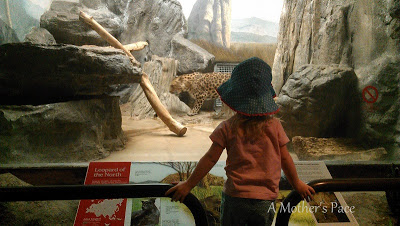
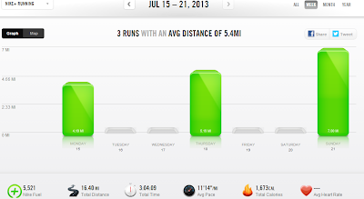

Last week I failed miserably at trying to fit exercise into a vacation. I had high hopes when I packed though because I brought along enough clothes to run 5 days. 3 sets of clothes came back clean and unworn.  
  
Yes, I only ran two times, while in Colorado, of all places.  
  
We went to Denver to travel with my husband for a work related trip. We spent a few days there and then headed down to Colorado Springs after my husband was finished with work for the week.  
  
We had a fantastic week on vacation and I'll write more about that later in the week but running definitely was lacking. It's so frustrating to me because I love to run in Colorado. But I'm a Mother Runner and 'mother' is first for a reason.  
  
Instead of running, I tackled traffic in a strange (to me) city so that my kids and I could enjoy Denver.  
  
Instead of running, I got up early (3:30!) with my daughter who was completely off schedule due to traveling.  
  
Instead of running, I made sure my kids made it down to breakfast to fuel up before our big days of sightseeing.  
  

  
Instead of running, I went to the zoo and watched animals with my children. I decided my legs wouldn't be very happy with me if I ran and then walked at a zoo lugging around children and a double stroller for 7.5 hours.   
  
O.k., so the list could go on.   
  
Could I have fit in more running? Yes.   
  
Did I want to run? Yes.   
  
Was more running the right thing for me to do on this trip? Nope, and I'm o.k. with that. (Even though I hated seeing my pile of running clothes untouched in the morning!)  
  

  
I'm so thankful that our hotel was located in downtown Denver and very close to the Cherry Creek running path. I woke up early twice to run and took that path both times. So I enjoyed good quality runs on the days that I was able to get out there. More on that this week too.  
  

  
**Weekly Workouts**  
  
Monday: 4.19 miles  
  
Tuesday: Walked around the Denver Zoo for 7.5 hours, Core Work  
  
Wednesday: Unexpected Rest Day  
  
Thursday: 5.19 miles  
  
Friday: Hiked around Cheyenne Mountain Zoo  
  
Saturday: Rest Day  
  
Sunday: 7 miles (back home and back to the training plan!)  
  

  

  
Total Running Miles: 16.38  
Weekly Average Pace: 11:14  
  
July Running Miles: 43.88  
2013 Running Miles: 188.26  
  
  

**Do you run while on vacation? How do you fit it in?**  

  
  

\------------------------------------------

  

  
Find A Mother's Pace on...  
  
Twitter [@amotherpace3](https://twitter.com/amotherspace3)  
  
Facebook [http://facebook.com/amotherspace3](http://facebook.com/amotherspace3)   
  
Instagram [amotherspace](http://instagram.com/amotherspace)  
  
RSS [amotherspace](http://feeds.feedburner.com/amotherspace)
