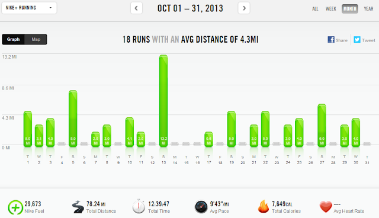

  
November, already! November means cold, winter weather. Even though we have had snow here already, it definitely doesn't feel like winter yet. Our trees here are looking beautiful. Something about the temperature and the mix of rain that we've had this summer/fall has made the perfect combination. We haven't had a fall this pretty in several years.  
  
I'm jumping in to recap October.  
  
**Mothering Moments**  
  
  
  
Halloween was a huge success this year. Of course, it was Little E's first Halloween and even though she was out way past her bedtime she laughed and kicked her legs during most of the trick or treating.  
  
**Racing/Training**  

October brought 1 race. The Wichita [Prairie Fire Half Marathon](http://amotherspace.blogspot.com/2013/10/prairie-fire-half-marathon-race-recap.html). Even though it wasn't a PR race for me (12 seconds off!!!), it was probably my smartest race I've ran and it was also my husband's first half marathon!

  

  
**A Few of my Favorites from A Mother's Pace**  
  
[A Tribute and a New Start](http://amotherspace.blogspot.com/2012/09/a-tribute-and-new-start.html)  
  
It's from the archives but it's one of my favorites from last year.  
  
[Sausage Bake](http://amotherspace.blogspot.com/2013/10/sausage-bake.html#.UnK48PlQEYk)

  

A paleo friendly Sausage Bake that can easily be adapted into a delicious vegan meal. Yum!  
  
[Apple Picking](http://amotherspace.blogspot.com/2013/10/apple-picking.html#.UnPHA_lQEYk)  
  
This was one of my favorite family activities of the month and something I'm hoping to make an annual event!

  

  
**Favorite Running Gear**  
  
I'm going to say my treadmill this month. With the dark mornings and stormy weather we've had lately my treadmill has helped many runs to actually happen. I have a bare bones Proform treadmill but it works for me and I don't need all the bells and whistles.  
  
**Workouts in October**  
  
  
  
Total Running Miles: 78.18  

Treadmill Miles: 15  
Stroller Miles: 3  

Average Pace: 9:43  
  
Total Running Miles for 2013: 456.12  
  
  

\--------------------------------

  
Find A Mother's Pace on...  
  
  
Twitter [@amotherspace3](https://twitter.com/amotherspace3)  
  
  
Facebook [amotherspace3](http://facebook.com/amotherspace3)  
  
  
Instagram [amotherspace](http://instagram.com/amotherspace)  
  
  
Pinterest [amotherspace](http://pinterest.com/amotherspace/)  
  
  
Bloglovin' [A Mother's Pace](http://www.bloglovin.com/en/blog/6680087)  
  
  
RSS [amotherspace](http://feeds.feedburner.com/amotherspace)
