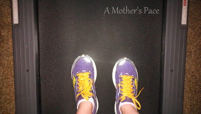
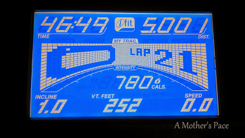

My run for October's [Fall 5 and 10](http://www.mommyrunfast.com/virtual-run-series/fall-5-and10-registration/) was on the treadmill. This month I decided to run 5 miles again. I don't have a good 5 mile route that I like to run early in the darkness of the morning so I decided to run in the basement instead.   
  
  

  
It was a tough run mentally. The first mile in I was already trying to get out of finishing. I kept telling myself I could run the 5 miles after my husband was off work the next day. Then I just decided to run for 3 miles. When I hit 3 miles it dawned on me that 2 more really isn't that long so I should just do it and get it over with.   
  
It's funny how much perspective changes in just a few days. Over the weekend I ran 9 miles on the treadmill and so 5 should seem easy in comparison, right?   
  
And I felt so good after the run was over. I was proud of myself for finishing even though my mind was telling me to give up. I ignored the negative thoughts and pushed through the entire 5 miles. I love running but still have the dreaded negative thoughts every now and again.  
  
My goal with this 5 and 10 series is to increase my pace just a little every month. It's kinda cheating (doing it on the treadmill) because it's so much easier than outside on the pavement. I stuck to a 6.4-6.6 pace for the entire run and my overall pace ended up being 9:21. **[Last month I ran the 5 miles](http://amotherspace.blogspot.com/2013/09/a-labor-day-bestrun-5-and-10-virtual.html#.UksFh4ZQEYk)** at a 9:31 pace, so I met my goal!  
  
  

  
Distance: 5 miles  
Time: 46:49 minutes  
Average Pace: 9:21  
   

**How do you overcome negative thoughts while running?**

\------------------------------------------

  

Staying at home with kids sounds easy, right? Life with 3 little ones is busier than I imagined. I don't write every day on the blog but I do update Facebook, Twitter and Instagram more often.   
  
Find A Mother's Pace on...  
  
Twitter [@amotherspace3](https://twitter.com/amotherspace3)  
  
Facebook [amotherspace3](http://facebook.com/amotherspace3)  
  
Instagram [amotherspace](http://instagram.com/amotherspace)  
  
Pinterest [amotherspace](http://pinterest.com/amotherspace/)  
  
Bloglovin' [A Mother's Pace](http://www.bloglovin.com/en/blog/6680087)  
  
RSS [amotherspace](http://feeds.feedburner.com/amotherspace)
