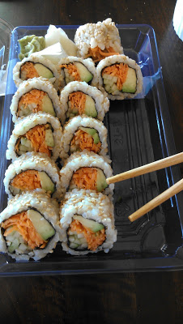

Tomorrow it will be ONE WEEK until my due date! 7 days...or less. Hopefully not more but I know it is possible.  
  
So we're all baby around here. We spent our extra time last weekend getting ready for the new baby's arrival.  
  

  
I'm finally completely packed and ready to go. I just have to check my list of the last minute things to add to the bag before we leave for the hospital.  
  

  

  

  

  
The bassinet has been washed and reassembled. Little O & A were great helpers! They love to help Daddy do anything with tools lately.  
  
The bassinet and the packing were really the last two things that we needed to accomplish for sure before the baby arrived. So now we're ready and waiting.   
  
I'm eating some really strange things lately.   
  

  
For some reason this turkey, olive and mustard sandwich sounded good and more importantly _tasted_ good the other day. I might just have to have that again for lunch today!  
  

  
My husband also surprised me and brought (Vegetarian) Sushi home for a snack. I have missed Sushi terribly and can't wait until we go out to celebrate the new baby with our traditional Sushi night. This was a great little snack to tide me over for a few weeks. The wasabi is wonderful and the ginger, delicious.  
  

  
I love how Little A rubs my belly when we snuggle at nap time. There is a lot less room for her in the rocking chair now but she doesn't seem to mind the extra pillow.   
  

  
Sleepy girl.  
  

  
Our favorite game lately is Zingo! Here is my birds eye view of the game. We've been playing this a lot before bed time at night. It's a great quick game that everyone enjoys. Bingo with a Zing!  
  
My doctor's appointment this week went well. Here's to hoping that it will be my last one and I'll go into labor before my next scheduled visit on Monday. When I saw my doctor this week he asked me where I was this past weekend. He said that I missed the baby train and that he had delivered two other babies over the weekend. Too bad! :)  
  
39 Weeks Pregnant tomorrow!
