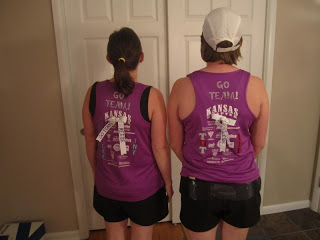
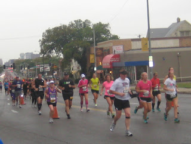
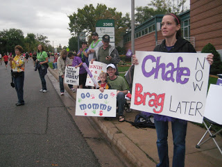
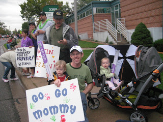
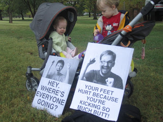
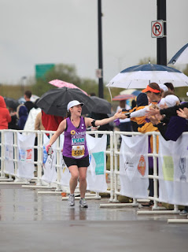
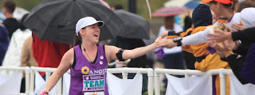

I'll admit, writing a race recap a year after the race happens is not ideal. I'm not going to remember all the little details that made this race day so important for me. That said, this race _was_ important for me and I _want_ to remember it. So I'll put down the memories that I have a year later.

  

A year ago I didn't have this blog and had started my "[Team in Training Journey](http://angie-russell.blogspot.com/)" blog to track my journey of logging miles and raising funds for the Leukemia and Lymphoma Society's [Team in Training](http://www.teamintraining.org//). I wasn't very faithful in updating my blog and I kick myself for not at least doing a wrap up post of my first marathon experience. 

  

I'll start from the beginning!

  

Sunday, October 9th 2011. [Wichita Prairie Fire Marathon](http://www.prairiefiremarathon.com/)

  

I woke up feeling a little nervous but mainly excited. I had worked so hard to accomplish 26.2 miles and I hoped knew I was ready. 

  

My sister-in-law picked me up to head down to the starting line.

  

  

  

We were running to raise money for Team in Training. We were also running in honor of many loved ones who have been affected by a blood cancer. Mainly our 8-year-old niece and my grandma. Running to honor people who are dealing with cancer is such an emotional motivator. I never thought I could accomplish 26.2 miles but when I think about how tough my niece is when it comes to cancer and when I think about all that my grandma went through with her fight with leukemia running really seems like so little. 

  

When we got downtown and parked we started walking to the start line. On the way we talked to a man from Wisconsin. He was attempting to do a marathon in each state and was crossing Kansas off of his list. Amazing!

  

We cheered the early start marathoners on and then waited for our turn. Finally it was here! My sis-in-law and I started together (for the first few minutes) but then I went ahead. She was running the half using a run/walk method. We had trained a little together until I realized that the run/walk method was hurting my knee. If I just ran my knee felt fine but if I stopped to walk at all my knee started throbbing. 

  

 I made it to mile 3 a little quicker than I had anticipated. Probably not the smartest thing...   

  

  

My cheer squad was waiting for me. It really lifted me up every time I saw my husband, children and the rest of our family that came out to cheer all of us on.

  

At the half way point I specifically remember a man running behind me talking about how glad he was just doing the half. He said "See you later, suckers!" as he turned and followed the 13.1 course. I smiled to myself and wondered what I had gotten myself into! 

  

The course took us through some pretty parts of the city. It took us through downtown, neighborhoods and parks. They had bands along the way to entertain us. My favorite was Ten Day Wish. I love to go out dancing when they are playing and so it was a treat to hear them while running. The best part about it was when I actually ran by them they were singing one of my favorite No Doubt covers. It really pumped me up! I waved to the lead singer as I went by and she pointed right back at me. Then I noticed my cheering squad again. 

  

  

My brother-in-law from Chicago made some of the best marathon signs and my husband printed them out. I saw my sister's poster (at mile 9??) and it made me laugh. I was just having fun and enjoying everything. 

  

The course took us through a couple more neighborhoods on the East side of town and then we headed back to the West. We ran a long stretch down Douglas Street. When I was almost back to the downtown area I realized that I had to stop at a port-a-potty. I really didn't want to have to take time out for a pit stop but I knew I wouldn't make it the entire race. I only had to stop this one time!

  

Then we ran through Riverside. This was my favorite part of the race. It's my neighborhood. Before getting married I lived there and ran in that area every week. I've ran a lot of miles around the river and I was so happy to run some of my marathon miles on some of my favorite roads. 

  

This was also the last time that I saw my husband and kids during the marathon. I was running with one of the Team in Training support people when I noticed C.J. She told me to run over and say hi to them so I did. I gave everyone a hug and kiss and then hurried on my way. 

  

The weather for the marathon wasn't ideal by any means. It could have been worse but it could have been a lot better. It was chilly and rainy. The rain wasn't too bad though because my shoes only felt soggy once (after accidentally stepping in a puddle) and I didn't get any blisters from the extra moisture.

  

I also discovered a few new running paths by Cowtown and Botanica that I want to run on again. It was a very pretty area and it had a lot of trees. Someday, when I start driving to get my runs in, I'll go back there. It's only about 20 minutes or so from my house now, so not bad at all. It was also in this area that I had a couple more Team in Training support runners run a mile or so with me. So helpful!

  

I'm guessing that I ended up hitting THE WALL around mile 20. I was running by the river and I started to think of my grandma. I had been thinking of her the whole race but thoughts around mile 20 are much different than at any other point during the race. As I mentioned earlier, my grandma was suffering from leukemia and she didn't have that much longer to live. She was an amazing woman and at this point I started to cry when I thought of her. Emotions are so raw at the end of a marathon. I was just glad that no other runners were around me so I could have this moment and not be too embarrassed! 

  

It was towards the end that I ran by Mr. Wisconsin again. He had started his marathon at the early start and was injured so he was walking quite a bit of the marathon. I chatted with him for a few minutes and then headed off on my own once again.

  

The last 6.2 miles were tough. Probably the third toughest thing I've ever done. (Giving birth twice _was_ more difficult than the last few miles...but not much!) It's running together in my head so I don't any specific memories from this part of the race. Just how tough both mentally and physically it was. 

  

Then I could see it...the finish line! 

  

  

And to watch me at the finish was my husband and two children. (I'm sure that others were there too but I was focused on those three!) It means so much to me that they were there to help me celebrate my accomplishment. C.J. had a marathon of his own trying to navigate two young children, a very big stroller and marathon signs all around the course (in the rain!) to cheer me on. 

  

So, I did it! 26.2 miles in 5:04:52. I ran it to finish, not really with any time goal. Later on that day and several days after I was in pain. I told C.J. never to let me run one of these again. Stairs were treacherous and we had a lot of unavoidable stairs in our house. 

  

Of course I have plans to run another marathon. Not really any time soon. I learned my lesson on how difficult it is to breast feed a child under age one and train for a marathon at the same time. So I have my sights set on the Chicago Marathon 2014. I would like to train to race a marathon not just train to finish. 

  

Distance: 26.2

Time: 5:04:52

Average Pace: 11:39

  

