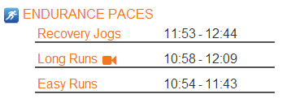
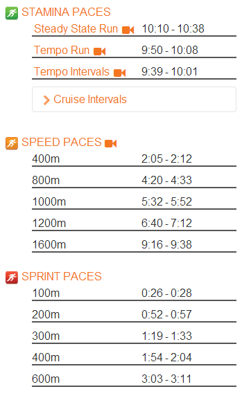

My week of running started out with a new training plan for a race in the fall.  
  
  

  
Since I'm running with Team in Training I thought it was appropriate to wear my Cancer Sucks Bondiband for my first training run.   
  
It was a nice and slow 2 mile recovery jog. I'm going to try and stick to certain paces during my training. I usually enter a 5K race time into the [McMillian Running Calculator](http://bit.ly/130Uelt) but this time around it's a little different for a couple of reasons.  
  
The first being that my last 5K race isn't an accurate race time. I think I can do better. It was on a warmish evening and I had previously been used to running in the cool mornings.   
  
It was also a month ago. Since then I've ran every single day because I'm participating in the Runner's World Summer Run Streak. Every day. I know this has made me a little faster and a little closer to my pre-pregnancy speed.   
  
The second reason is that I think my fitness level is changing pretty quickly.   
  
  

<table align="center" cellpadding="0" cellspacing="0"><tbody><tr><td></td></tr><tr><td>A 4 month old Little E = 4 months postpartum for me.</td></tr></tbody></table>

I'm 4 months postpartum this week and I'm almost feeling like a normal runner again. Running is still really hard for me right now but I think at this point it has more to do with the heat of the summer than fitness lost throughout my pregnancy.  
  
So what to do? When I entered my info into McMillan's calculator the training paces came back very slow! According to that my recovery jog today should have been between an 11:53 and 12:44. 
  
  

I'm still pretty slow but that seems awfully slow to me. But should I doubt it? Should I slow down almost a minute per mile once a week on these recovery runs?  
  
I'm fine with the long run pace. The past two weeks my long run has been in this range. I don't want my long runs to be that slow but it's what they are right now.  
  
The easy run pace also seems a little slow to me. Most of my easy runs have been at least 30 seconds faster than that.   
  
What this is telling me (I think) is that I need to run by feel and keep these paces as a guide. If I'm feeling good on an easy run day and the effort feels 'easy' I can bump up my pace a little. If it seems difficult I know I can slow down to McMillan's range above and still be o.k. for training.  
  
I also usually use his pace guide for speed work during training as well.   
  
  

  
I haven't kept times during recent speed sessions so I'm not sure how these times will work for me right now. I plan on starting with these paces for various types of workouts and then adjust them if needed.  
  
  
  

**Do you run by feel? Do you follow certain paces during training?**

  
  

\------------------------------------------

  

  
Find A Mother's Pace on...  
  
Twitter [@amotherpace3](https://twitter.com/amotherspace3)  
  
Facebook [http://facebook.com/amotherspace3](http://facebook.com/amotherspace3)   
  
Instagram [amotherspace](http://instagram.com/amotherspace)  
  
RSS [amotherspace](http://feeds.feedburner.com/amotherspace)
