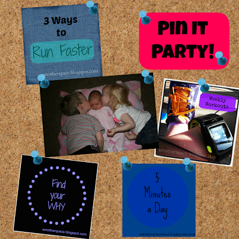

It's Pin It Party Time!   
  

  
Lindsay over at [**The Lean Green Bean**](http://www.theleangreenbean.com/pin-it-party-3/) is hosting a pinning party and I'm joining in on the fun. Be sure to visit her blog to find a bunch of great posts to pin or to link up your own Pin It Party post.  
  
Are you following me on Pinterest? If not **[click here](http://www.pinterest.com/amotherspace)**. I pin recipes, strength workouts, treadmill workouts, motivational quotes and much more!  
  
Here are a few of my favorite posts from A Mother's Pace over the past couple of months.  
  
[**How to Run Faster**](http://bit.ly/1dZr3UI)  
  
Just about everyone, no matter their speed, wants to run faster. I've struggled with this after having my last baby and shared some tips in this post.  
  

  

 **[Hot, Hot, Hot](http://bit.ly/17P0A7T)**  
  
Unfortunately it's still really high temps where I live so I'm still using these ideas for how to deal with hot summer running.  
  
  

  
[**It's Time to Make a Change**](http://bit.ly/17WlmP1)  
  
Do you eat 'real food?' How do you handle eating out and trying to eat quality food? An update on this post: We only ate out once during the entire month of August and that was for a birthday. All it took was a little bit of commitment to meal planning.  
  
  

  
[**4 Tips for Running in the Rain**](http://bit.ly/17OZXeD)  
  
We had a RAINY summer which gave me the perfect opportunity to run in the rain. Here are a few tips that I used on my rainy runs.  
  
  

  
[**5 Minutes a Day**](http://bit.ly/17P02ii)   
  
5 minutes is not a lot of time but it really adds up. What can you do with just 5 minutes a day?  
  
  

  

  
Here is a link to my first [Pin It Party](http://bit.ly/1872aht), just in case you missed it.  

  

\------------------------------------------

  

Staying at home with kids sounds easy, right? Life with 3 little ones is busier than I imagined. I don't write every day on the blog but I do update Facebook, Twitter and Instagram more often.   
  
Find A Mother's Pace on...  
  
Twitter [@amotherspace3](https://twitter.com/amotherspace3)  
  
Facebook [amotherspace3](http://facebook.com/amotherspace3)  
  
Instagram [amotherspace](http://instagram.com/amotherspace)  
  
Pinterest [amotherspace](http://pinterest.com/amotherspace/)  
  
Bloglovin' [A Mother's Pace](http://www.bloglovin.com/en/blog/6680087)  
  
RSS [amotherspace](http://feeds.feedburner.com/amotherspace)
