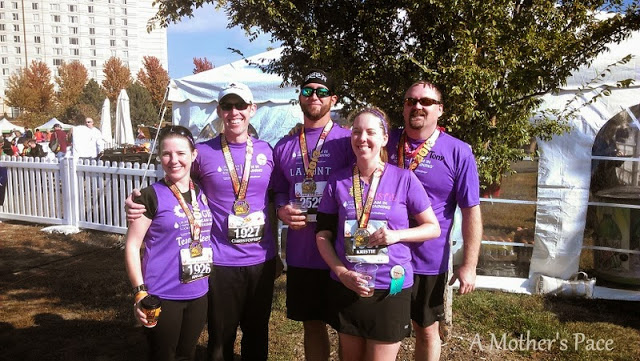
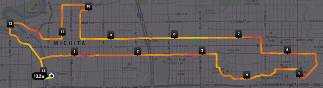
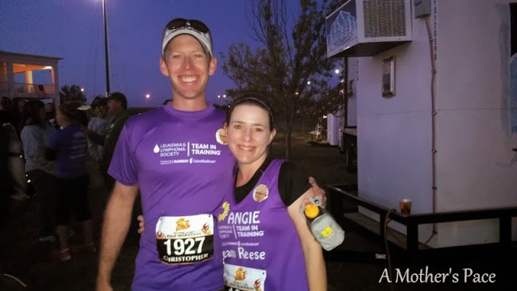
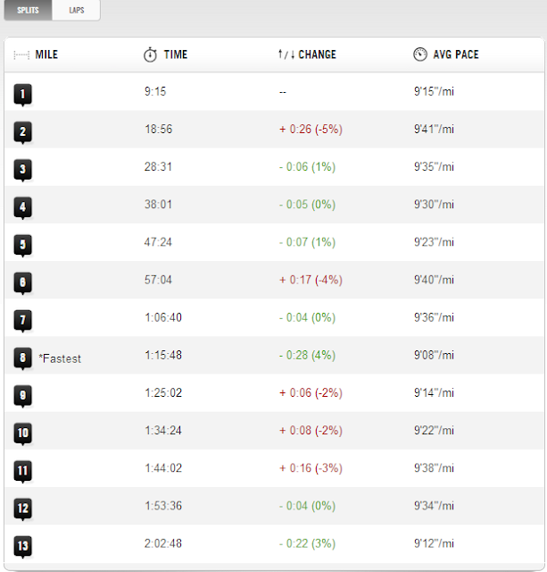
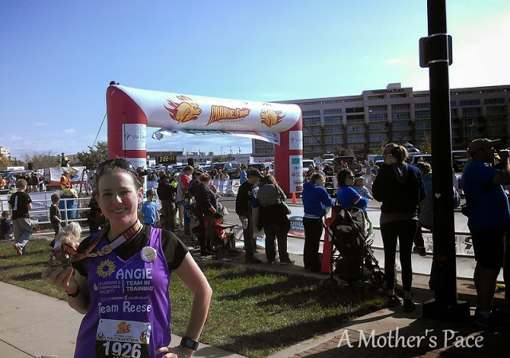
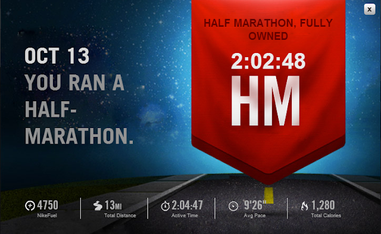

Spoiler alert: I surprised myself with my half marathon on Sunday. I did much better than I thought I was going to and I improved my time from a few weeks ago by about 5 minutes. That said, I missed my A goal by 12 SECONDS. 12 measly seconds from a PR!   

  

I ran the Prairie Fire Half Marathon with Team in Training (TNT) to help Team Reese raise money for the Leukemia and Lymphoma Society. In total we had 7 people on our Team Reese and together we raised $10,525! Because we have a research center here in Kansas all of that money will stay in Kansas to help families in need and to research blood cancers. 

  

<table align="center" cellpadding="0" cellspacing="0"><tbody><tr><td><a href="http://amotherspace.net/wp-content/uploads/2013/10/IMAG28501.jpg" imageanchor="1"></a></td></tr><tr><td>Representing Team Reese at the Prairie Fire Half Marathon</td></tr></tbody></table>

  

Since this is my second TNT event in just a few weeks that I have written about I'm not going to write much about why I joined Team Reese. Follow this **[link](http://amotherspace.blogspot.com/2013/09/see-jane-run-half-marathon-wichita-race.html#.UlxLq1BQEYk)** to find out more about my amazing niece and why I fight (and run) to find a cure for cancer. 

  

The **[Prairie Fire Marathon Series](http://www.prairiefiremarathon.com/)** is a favorite of mine. I've ran the **[Full](http://amotherspace.blogspot.com/2012/10/one-year-ago-today.html#.UlymflBQEYk)**, the **[5K](http://amotherspace.blogspot.com/2012/10/wichita-prairie-fire-2012.html#.Ulyml1BQEYk)** and now the Half. It's a flat and fast course with about 3000 participants between the 3 races this year. 

  

  

I can't say that the course is my favorite half marathon course in Wichita. But it does go through some nice neighborhoods in town.  
  
Race start was at 7:30. My husband and I left the kids with Grandma, Nana and Papa and we headed down to the start line.   
  
  

  

This was my husbands first half marathon. I'm not going to spoil too much of his story because I'm hoping he'll do a guest post for me later on this week. He rocked his first half though! I'm so proud of him.

  

I decided to start by myself instead of with the TNT team. I positioned myself a little bit after the 2:00 pacer, basically right with the 4:00 marathon pacer. My A goal for the race was to try and squeeze in a PR. That would mean anything better than a 2:04:33. My last half marathon 4 weeks ago was 2:09:27. My B goal was to beat the 2:09 time. I honestly didn't really have a C goal.

  

My plan to reach this goal was to stick to as close to a 9:30 pace I could during the entire race. My last half I tried to start at 10:30 and increase the pace during the race but that is just too hard for me mentally. It's much easier for me to hit one pace early on and stay with it instead of playing catch up for the entire race.

  

  

My pace wasn't incredibly steady but my average pace (that's what I watched during the race on my sportwatch) was right on during the entire race. For most of it I was at a 9:29 pace, occasionally slipping to 9:31. Then in the last few miles I bumped it up to 9:26.

  

I had some great support along the way. My family and friends cheered me on close to the 3 mile marker and the 8 mile marker. It's always wonderful to see everyone along the way.

  

  

I decided to carry water during this race as well. Stopping or slowing down during the water stops is just too hard for me. It's much easier for me to stay at the same pace and not stop at all. My support crew at mile 8 gave me a full water bottle that I could switch out with my empty.

  

For running fuel I ate a HoneyStinger gel at mile 4 and again at mile 7.5 or so. I also packed (on accident, I meant to eat all HoneyStingers during the race) a Salted Caramel GU and ate it around mile 10. I hadn't had one before but I bought one earlier in the week because everyone is RAVING about them. I did enjoy the taste a lot but the consistency is a little thick. I prefer the HoneyStingers, especially in a race setting.

  

My fueling and water worked perfectly. I never felt my energy dip and I was able to speed up at the end of the race. If only I had sped up a little more....12 seconds!!

  

The College Hill neighborhood during the course was probably my favorite area. A lot of people were out on their driveways and in their yards to cheer us on. Some people were partying and having a great time! I noticed that there were also a lot of dads along the way with 1 or 2 kids. I got to hear some of them cheering their mommy on and it made my day as well.

  

  

Overall, the race was fun and it went very well. I was worried that I wouldn't be able to speed up towards the end and so I kept putting it off. I wish that I had started speeding up a little earlier and not saved it for the last mile. My legs were shaky when I finished but I still had some energy in me. I didn't leave it all out on the course and that only gives me hope (or determination) for next time.

  

  

Here are the numbers for my 5th half marathon:

  

Official Distance: 13.1 miles

Nike+ Distance: 13.22 miles

Official Time: 2:04:45

Nike+ Time: 2:04:47

Offical Average Pace: 9:31

Nike+ Average Pace: 9:26

Overall Placement: 652/1639

Age Placement: 58/193

  

  

Updated to add: Linking up with [Jill Conyers](http://jillconyers.com/) and [Running Bloggers](http://runningbloggers.com/) for Fitness Friday.  
  

\------------------------------------------

  

Staying at home with kids sounds easy, right? Life with 3 little ones is busier than I imagined. I don't write every day on the blog but I do update Facebook, Twitter and Instagram more often.   
  
Find A Mother's Pace on...  
  
Twitter [@amotherspace3](https://twitter.com/amotherspace3)  
  
Facebook [amotherspace3](http://facebook.com/amotherspace3)  
  
Instagram [amotherspace](http://instagram.com/amotherspace)  
  
Pinterest [amotherspace](http://pinterest.com/amotherspace/)  
  
Bloglovin' [A Mother's Pace](http://www.bloglovin.com/en/blog/6680087)  
  
RSS [amotherspace](http://feeds.feedburner.com/amotherspace)
