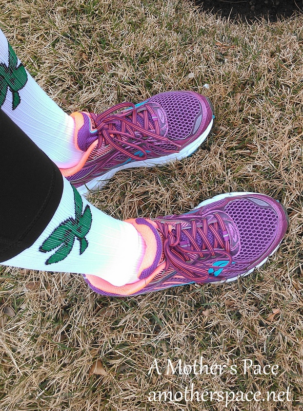
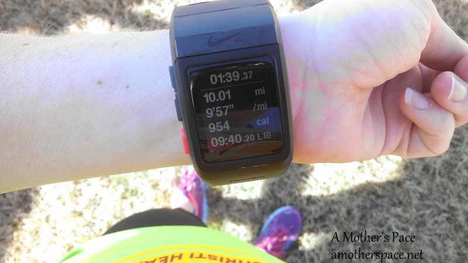
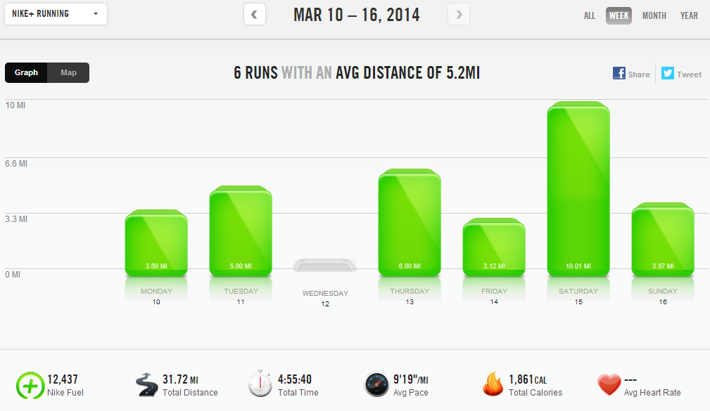

Last week I had 6 days of running and my highest mileage week in awhile. I hit the 30 mile mark and according to my training plan, this is around what my mileage is going to be for the next several weeks. I'm feeling good and enjoying all the miles.

 

 

Yesterday I ran a local St. Patty's day race. I'll have my recap ready for tomorrow, hopefully. Today I wanted to talk about the logistics of racing while training for a goal race.

One of the reasons why I like the Hal Higdon training plan is that he allows for racing within the plan. He specifically says that racing is important during training and leaves room for two or sometimes three races within a plan.

This time around I'm using the Own It plan from the "[Train Like a Mother](http://amzn.to/10eETuP)" book by Dimity McDowell and Sarah Bowen Shea. It's a lot harder than the Intermediate Higdon plan I've done in the past and there aren't any races built into the plan.

Because of this, I had to figure out how to fit a 4 mile race into my plan right in the middle of training.

My two choices were

- Run long before the race on Sunday. My husband would drop me off 10 miles away from the race. The 10 miles plus 4 race miles would equal the 14 in my weekly plan.
- Run long on Saturday for 10 miles. Then race on Sunday.

 

 

In the end I chose option number 2 and I'm so glad that I did. I felt like I was cutting a corner because a 10 mile run + a 4 mile run on two days is very different from a 14 mile long run. Timing was the main factor in my decision though. I'm still nursing my 12 month old daughter and the logistics of feeding her before and getting back home in time to feed her again turned out to be too difficult.

 

 

Instead I enjoyed a beautiful 10 mile run on Saturday morning. It was gorgeous out and there was no wind. If I had ran the 10 miles before the race I would have ran in 30 degrees that 'felt like' 22 with wind gusts of 36 MPH. That was hard enough during the race and it would have made the 10 miles prior miserable.

 

 

 

 

**Weekly Workouts**

Monday: 3.6 miles (9:27 pace) + 25 minutes strength + core work

Tuesday: 5 miles (8:53 pace) + 25 minutes NTC back definer + core work

Wednesday: Rest Day

Thursday: 6 miles (9:06 pace) + 25 minutes NTC leaner legs + core work

Friday: 3.12 miles (9:19 pace) + 15 minutes NTC sculpted arms

Saturday: 10 miles (9:57 pace)

Sunday: 3.97 miles (8:34 pace)

 

 

 

One of my main goals for 2014 is to Run This Year in kilometers. That's 2,014 kilometers or 1,251.44 miles.

Weekly Running Miles: 31.70

Weekly Average Pace:9.19

March Running Miles: 71.46

2014 Running Miles: 250.59

2014 Running Kilometers: 403.29

 

 

**How do you fit racing into a training plan? Would you have ran 10 miles before a 4 mile race to fit in a long run?**

 

 

\---------------------------

Find A Mother’s Pace on…

Twitter [@amotherspace3](https://twitter.com/amotherspace3)

Facebook [amotherspace3](http://facebook.com/amotherspace3)

Instagram [amotherspace](http://instagram.com/amotherspace)

Pinterest [amotherspace](http://pinterest.com/amotherspace/)

Bloglovin’ [A Mother’s Pace](http://www.bloglovin.com/en/blog/6680087)

RSS [amotherspace](http://feeds.feedburner.com/amotherspace)
