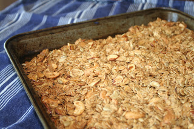
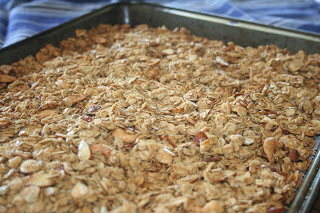
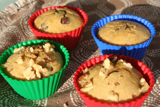

  

  
Right now I have granola baking in the oven. I'm making it for the first time and it is so easy! It smells wonderful and I can't wait to taste it. It is another recipe that I found on the [100 days of Real Food](http://www.100daysofrealfood.com/2010/04/04/recipe-granola-bars-cereal/) blog. My husband and I have been trying to figure out a healthy breakfast option for our children. We have made several different variations of oatmeal and really the only one that they liked a lot was a [baked oatmeal](http://budgetbytes.blogspot.com/2011/12/banana-bread-oatmeal-367-recipe-046.html) that was very good but too time consuming to make for every breakfast.  
  
  
Every morning I make a bowl of oatmeal for myself. It is very filling and very good. The kids usually have Quaker Oats because they love the Raisin, Date & Walnut kind. Right now I would rather they have something relatively healthy in their bellies for breakfast even if it is processed. My husband usually eats cereal or oatmeal as well.  
  
  
Tomorrow we are trying the granola for breakfast. Hopefully it will be a hit with the kids.  
  
  

  

I bought a lot of the nuts for the granola at my grocery store and then went to Whole Foods to buy oats, wheat berries (for another recipe) and pumpkin seeds in their bulk bins. The bulk bins are the way to go! Everything that I had already bought at the grocery store (cashews, sunflower seeds and sliced almonds) were at least twice as expensive than the bulk bins. Next time I will make a stop at Whole Foods first. 

  

The pumpkin seeds are delicious, by the way. I gave a few of them to the kids while I was fixing their lunch and they loved them. I'm going to keep them around for a nice little snack. 

  

This week I also made a second attempt at [whole wheat muffins](http://www.100daysofrealfood.com/2010/05/12/recipe-fruit-nut-or-berry-or-whatever-you-want-them-to-be-whole-wheat-muffins/). These turned out better than the first batch, although I have no idea what I did differently. They are so good that my kids call them 'cupcakes.' They have been enjoying these for one of their snacks for the past several days. One of the things that I like best about them is that you can add in any ingredient to the base recipe. So far we have added in chocolate chips, walnuts and pecans. I also bought frozen blueberries and strawberries for the next two batches. 

  
  

