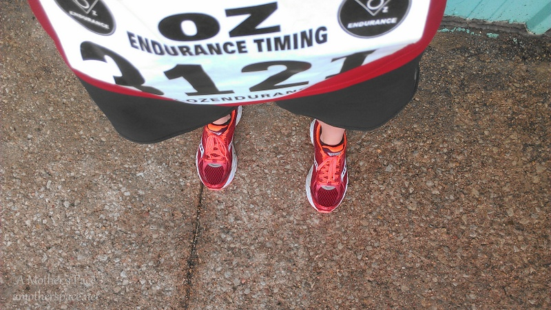
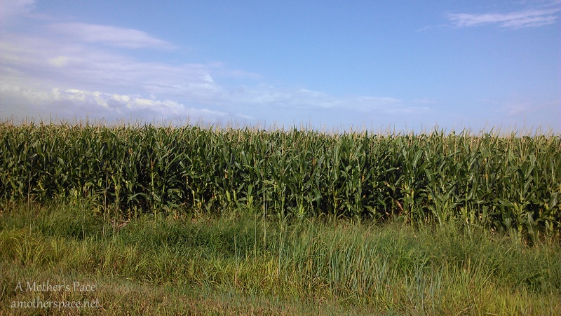
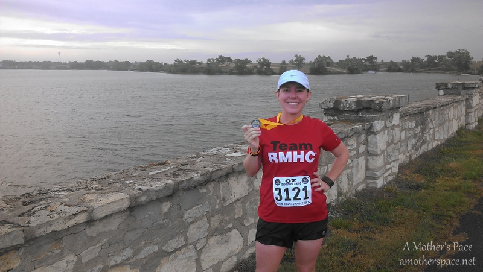
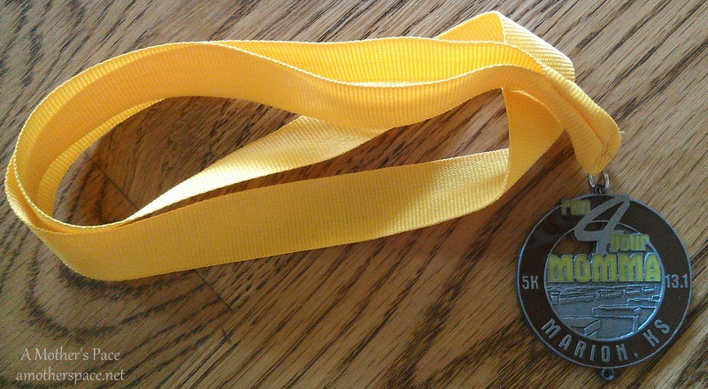

In just a few weeks I'm about to participate in my first very large big city race but recently I signed up for a small town, middle of Kansas race with only 44 participants. Yes, you read that right, only 44!  I've never ran anything that small before and I'd do it again in a heartbeat.

A while back I compared my training schedule with our local race schedule and noticed that Marion, Kansas had a half marathon scheduled for the same Saturday that I was supposed to run 13 miles. It was the Run for Your Momma Half Marathon to benefit the MOPS (Moms of Preschoolers) program in Marion. I figured that running a race would break up some of these long runs all by myself. I planned on running this as a training run to practice my marathon pace in a race setting. I wanted to practice getting water at the water stops (I'm horrible at that!) and wear my Ronald McDonald jersey that I will wear for Team RMHC in Chicago. Well, I wore the jersey but failed on everything else. I just get too competitive (with myself) during a race and I have to _RACE_ it.

I had trouble sleeping the night before the race. It took me awhile to get to sleep and then at some point in the night my husband saw I was awake and informed me that the race takes about 45 minutes LONGER to drive than I had thought. He set his alarm earlier to go off at 4:00. Good practice for Chicago! Think positively!

My mom was watching the kids so my husband and I took off and drove towards Marion in the early morning. When we arrived my first hint that this was going to be a tiny race was the fact that hardly any cars were there and not many people. We went in and picked up our packet and looked at the course a little before heading out to the start line.

 

 

I loved lining up with such a small crowd. It was fun to listen to everyone chat and it was a really relaxed setting. The race director had a few announcements before the race started and a few runners had some questions. For instance, one asked if there would be water stops along the way, have I mentioned that this race was small?! And, yes, there were water stops.

Soon we were off and running on the country dirt roads. In that first mile the rain sprinkles started coming down and then not long after that it started pouring. The rain just made me smile. It was nice and refreshing and different. It made me feel alive.

 

 

Not only was I running on gravel, which I'm not used to, but we also ran by cows and corn fields. This was definitely a country race! If you're not from Kansas you might imagine that all of our races are like this but that's not the case. My hometown, Wichita, has just a population of just under 400,000 so most of the races I run have a fair amount of people involved. And most courses are on the city streets.

 

 

This course in Marion was challenging for me because it had a few pretty significant hills. Mile 10 had a killer hill! Not all of Kansas is flat but the city I live in is pancake flat. Hills are not in my training but every one of these that I tackled during this race I powered through with thoughts of that last bridge close to the finish line in Chicago.

My ultimate goal for the race was to try and hang on to a 9:00-9:05 pace and to FINALLY run a sub-2 half marathon. I started the first mile a little too fast (surprise, surprise!) and the gravel, rain and hills slowed me down. I knew I wouldn't meet my goal of a sub-2 but I was just hoping for a PR.

The race had great support with water stops every few miles and a couple of cars were driving back and forth in case any of the runners needed anything. The people running it were so helpful and nice. They were very appreciative that we had signed up for the race to help their organization.

 

 

I actually did end up with a new PR (by almost 2 minutes!) and I couldn't be happier about it. This was by far the most difficult course I have raced on and the fact that I got so close (yet so far away!!) to breaking 2 hours shows how far I have come.

I loved everything about this race. The gravel, rain, hills, cool air, and the small numbers. I would definitely consider running it again in the future. I think it was fun for me because it was so different from anything I had raced before.

 

## Run for Your Momma Half Marathon Results

Official Distance: 13.1

Nike+ Distance: 13.07

Official Time: 2:02:36

Nike+ Time: 2:02:37

Official Pace: 9:22

Nike+ Pace: 9:23

Age Group Placement: 2/3

Overall Placement: 21

Half Marathon: #7

14 in 2014: 11th race

 

\_\_\_\_\_\_\_\_\_\_\_\_\_\_\_\_\_

I’m running the Chicago Marathon with Team RMHC!

To find out more read my post about [Running for Charity](http://amotherspace.net/2014/06/the-chicago-marathon-running-for-charity/) or head over to my [fundraising page](http://www.kintera.org/faf/donorReg/donorPledge.asp?ievent=1097960&supId=399266070) to make a donation.

——————————-

Find A Mother’s Pace on…

Twitter [@amotherspace3](https://twitter.com/amotherspace3)

Facebook [amotherspace3](http://facebook.com/amotherspace3)

Instagram [amotherspace](http://instagram.com/amotherspace)

Pinterest [amotherspace](http://pinterest.com/amotherspace/)

Bloglovin’ [A Mother’s Pace](http://www.bloglovin.com/en/blog/6680087)

RSS [amotherspace](http://feeds.feedburner.com/amotherspace)
