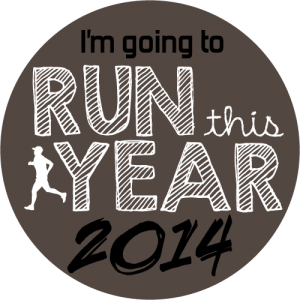
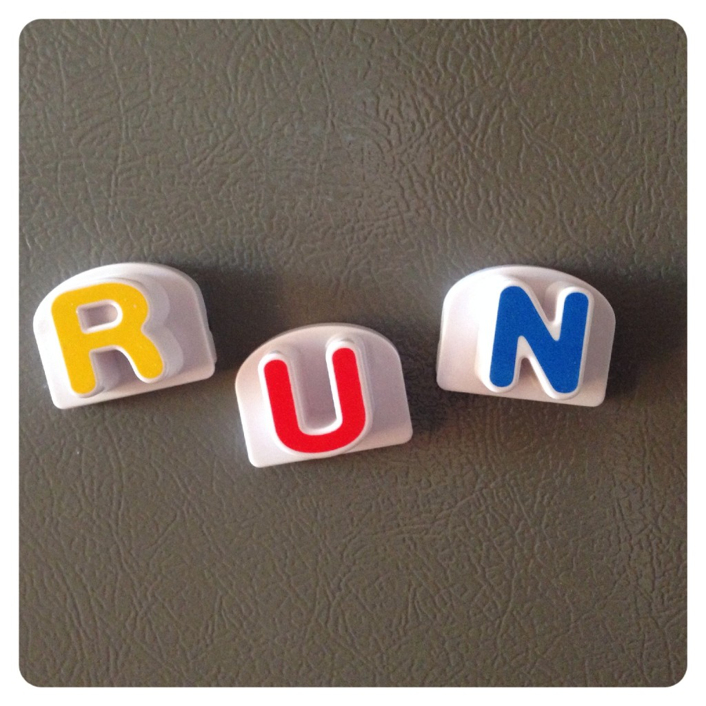
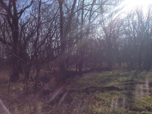
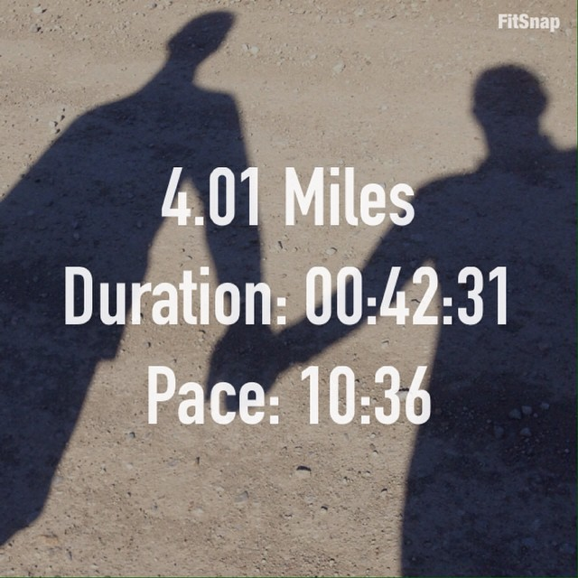

Almost a year ago I decided to try and run the most mileage that I'd ever ran in an entire year. I decided to join the Run This Year challenge and attempt to run 2,014 kilometers in one calendar year. That translates to 1,251.44 miles.

With my serious lack of running in November [due to an injury](http://amotherspace.net/2014/10/dealing-with-a-running-injury/ "Dealing with a Running Injury") I figured that my goal was out of reach. But recently when I added up my miles for the year I found that I had accomplished 1,192.23 miles so far! That only leaves 59.21 miles to reach my goal. Even coming out of my lowest mileage month of the year (November = 28.19 miles) I can't be that close and give up.

So I have a plan to squeeze in the last few miles before the end of the year. I'm hoping that my foot continues to feel okay while running. I'm not going to push it and jump back into running 100+ miles a month so this gives me a good goal to end the year on a high note. I'm also taking the time to focus on strength training and continue with stretching and yoga throughout the month as well.

 

 

I've scheduled 14 miles a week for the month of December which will add 62 miles to my year and take me just over my goal.

My weekly training log has been missing over the past couple of weeks because life has been busy and my blog has taken a backseat. Instead of recounting two weeks of workouts I'm just sharing this past week.

## Weekly Training Log

**Tuesday:** 3 miles (9:34 pace)

Treadmill run. Run one mile, jump off treadmill and stretch. Repeat x 3. The treadmill is the best tool for me right now because it's so easy to stop and stretch. When I'm outside running I don't tend to stop but inside it's a little treat to stop the treadmill for a few seconds in between miles.

**Thursday:** Thanksgiving Day hike with my husband.

We had a nice hike through the woods while the children were playing with relatives. We saw deer, rabbits and a huge rafter of turkeys. On Thanksgiving!

 

 

**Friday:** 4.01 miles (10:36 pace)

Country road run with my husband out to the train tracks and back to Nana and Papa's. Leaving the kids with family to run with my husband is such a treat!

 

 

**Saturday:** 5 miles (9:41 pace)

An outside, mid-morning run on the last weekend of November was nice. Wearing shorts and feeling great during the run was amazing!

 

One of my main goals for 2014 is to Run This Year in kilometers. That's 2,014 kilometers or 1,251.44 miles.

Weekly Running Miles: 12.01

November Running Miles: 28.19

2014 Running Miles: 1,192.23

2014 Running Kilometers: 1,918.71

 

 

 **How are your goals for 2014 coming along? Did you have any mileage goals set?**

\_\_\_\_\_\_\_\_\_\_\_\_\_\_\_\_\_

I’m running I ran the Chicago Marathon with Team RMHC!

To find out more read my post about [Running for Charity](http://amotherspace.net/2014/06/the-chicago-marathon-running-for-charity/) or head over to my [fundraising page](http://www.kintera.org/faf/donorReg/donorPledge.asp?ievent=1097960&supId=399266070) to make a donation.

——————————-

Find A Mother’s Pace on…

Twitter [@amotherspace3](https://twitter.com/amotherspace3)

Facebook [amotherspace3](http://facebook.com/amotherspace3)

Instagram [amotherspace](http://instagram.com/amotherspace)

Pinterest [amotherspace](http://pinterest.com/amotherspace/)

Bloglovin’ [A Mother’s Pace](http://www.bloglovin.com/en/blog/6680087)

RSS [amotherspace](http://feeds.feedburner.com/amotherspace)
