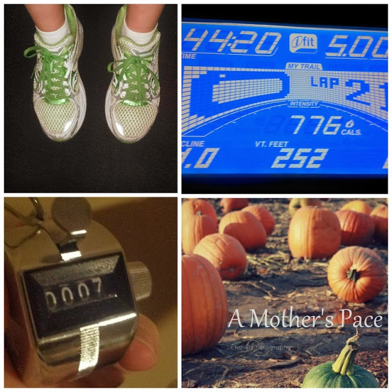
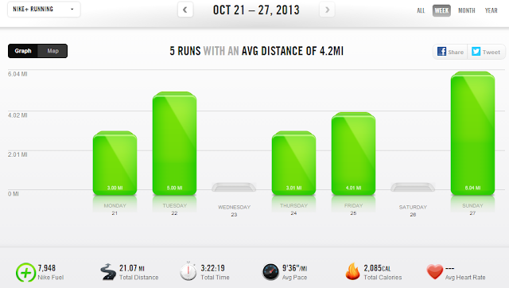

I love that the chilly fall air is giving me the opportunity to enjoy running outside in the afternoon and not just early in the morning to beat the heat.   
  
I've taken advantage of it several times this past week. My 8 month old daughter is doing some serious teething right now so she's not sleeping well during the night. I guess I should specify that she sleeps well if she's held. For a couple of nights last week I had between 3.5 and 4 hours of sleep and my husband was up with her too at various times.   
  
Needless to say when I am just getting in to bed at 5:00 a.m. I'm not going to hop out of bed when my running alarm goes off at 5:30!   
  
Instead it's worked out to run in the afternoon. Outside. I love it! Since it's not dark I can listen to music and until now I hadn't realized how much I had missed it.  
  
  

  
I've also had a good week of Strength Training. I'm still loving the Nike Training Club app on my phone and trying out new workouts from it. The ab workout above is one of my favorites. This week I squeezed in a spontaneous workout while my kids were playing near by. An ab workout in jeans and Toms? Whatever works!  
  
The 'Better Butt' workout last week was a killer. My legs were hurting more for a couple of days than they were after my last half marathon race. I'm definitely doing this one again.  
  
  

  
I also did my speed work of the week on the treadmill. It's hard for me to do speed work in my neighborhood in the dark. I'm not sure why. I still feel like I'm cheating when I do it on the treadmill but it's better than nothing!  
  
  

  
I ran a mile warm up (9:50 pace) then I started in on my 400's. Each 400 interval was at an 8:02 pace and the rest intervals were at a 9:05 pace. I ran 7 400's and then cooled down for a mile (9:12 pace). 5 miles total for an 8:52 average pace. It was a fun challenge but I'm happy to see my average pace for a run in the 8's again!  
  
  
  

  
Our Halloween festivities have started already. The kids were able to dress up for a fall party at school. Halloween is just too much fun with kids in the house!  
  
  
  

  
**Weekly Workouts**  
  
Monday: 3 easy miles (10:08 pace) + NTC Ab Burner  
  
Tuesday: 5 speed work treadmill miles (8:52 pace)  
  
Wednesday: Rest Day + NTC Better Butt  
  
Thursday: 3 \[supposed to be easy but ended up a little faster\] miles (9:27 pace)  
  
Friday: 4 easy miles (9:41 pace) + NTC Back Definer  
  
Saturday: Rest  
  
Sunday: 6 miles at long run pace (10:01 pace)  
  

  
  

  
Total Running Miles: 21.06  
Weekly Average Pace: 9:36  
  
October Running Miles: 71.18  
2013 Running Miles: 449.12  
  
  
  

**Can you do speed work in the dark? What time of day do you run?**

  
  

\------------------------------------------

  

Staying at home with kids sounds easy, right? Life with 3 little ones is busier than I imagined. I don't write every day on the blog but I do update Facebook, Twitter and Instagram more often.   
  
Find A Mother's Pace on...  
  
Twitter [@amotherspace3](https://twitter.com/amotherspace3)  
  
Facebook [amotherspace3](http://facebook.com/amotherspace3)  
  
Instagram [amotherspace](http://instagram.com/amotherspace)  
  
Pinterest [amotherspace](http://pinterest.com/amotherspace/)  
  
Bloglovin' [A Mother's Pace](http://www.bloglovin.com/en/blog/6680087)  
  
RSS [amotherspace](http://feeds.feedburner.com/amotherspace)
