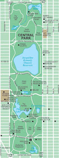
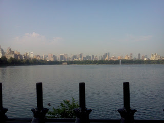
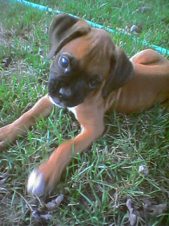
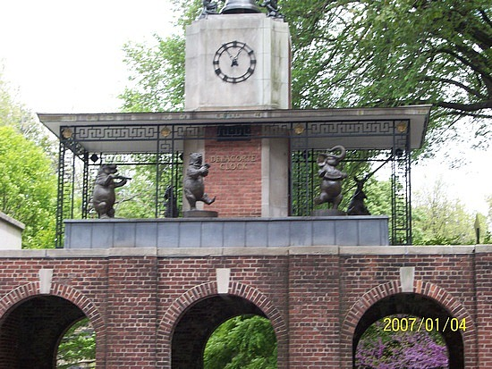
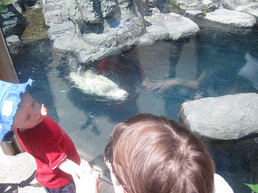
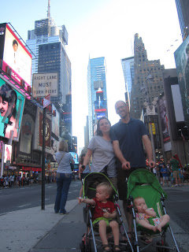
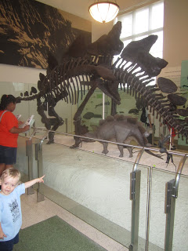

Let me start out by saying that I love New York City. I love people watching, I love using the public transportation, I love walking to my destination, I love the varieties of food (sushi, hot dogs in the park, pizza, bagels...should I go on?) and I love the millions of things to do in the city. Did I mention that I love New York??? One of my favorite places in the city is Central Park. When I'm visiting I like to stay close to the park so I have easy access for running.   
  
  
During our summer vacation to New York in 2011 we stayed in the city for a few days before heading out to Long Island. My main run to accomplish that week for marathon training was a 6 miler. Our hotel was South of the park and so I mapped out my course entering the park on the South side and working my way up to the Jacqueline Kennedy Onassis Reservoir. I wanted to do a loop of the reservoir and then head back to the hotel. I had my GPS locator turned on in my phone so my husband and sister could keep track of me on my run. I also missed several turns so I can only imagine the entertainment that I provided as well.  

[Source](http://www.google.com/imgres?hl=en&sa=X&biw=1024&bih=653&tbm=isch&prmd=imvns&tbnid=8mGSh1WP0_fnnM:&imgrefurl=http://gonyc.about.com/od/maps/l/blcentralpark.htm&docid=V9qZuRjbjqBZGM&imgurl=http://0.tqn.com/d/gonyc/1/0/U/1/centralparkmap.jpg&w=400&h=1075&ei=geWBT4mzE-u62gWDoeiXBw&zoom=1&iact=hc&vpx=92&vpy=59&dur=6120&hovh=368&hovw=137&tx=78&ty=394&sig=116523582734628439780&page=1&tbnh=167&tbnw=62&start=0&ndsp=21&ved=1t:429,r:0,s:0,i:70)

So I set out and ran a couple of blocks through the streets to get to the park. I crossed the street to get into the park. It was early in the morning so I didn't want to get too deep into the park by myself. My plan was to run for a little while in the park and then run the rest of the way to the reservoir on 5th Ave. Unfortunately I took my turn too soon and ended up running the majority of this part of my run on the street instead of in the park. (Picture my husband and sister yelling at me through the tracking system telling me that I am turning the wrong way. If only I could have heard them!) It wasn't awful though. I was still running in NYC and it was still scenic.   
  
  
I finally made it to the reservoir. I love the soft cushy feel of the track around the reservoir. I'm completely jealous of the New Yorkers that can run here every day if they want. They get a nice surface to run on and lovely views.  

  

After running a loop around the reservoir I headed South to get back 'home.' There were so many more people out now that I was a lot more comfortable about not following an exact route through the park. As my sister said, 'You can't really get lost, just look up and head toward the buildings to get out of the park.' So I ran where I wanted and let the paths lead me to new parts of the park.   
  
  
My weave through the park took me to a dog park. I'm not sure if it was an official dog park or not but there were a ton of dogs running around off leash. So fun! It made me miss our dog, Mika. It was hard to leave her for the week because she just started having seizures. Every time I saw a dog on this entire trip I thought of Mika at home...well taken care of by various family members while we were gone.   

<table align="center" cellpadding="0" cellspacing="0"><tbody><tr><td></td></tr><tr><td>One of my favorite puppy pictures of our boxer.</td></tr></tbody></table>

I also ran by the Central Park Zoo entrance. This zoo in particular is such a magical place!   
  
  

<table align="center" cellpadding="0" cellspacing="0"><tbody><tr><td></td></tr><tr><td>Central Park Zoo Entrance</td></tr></tbody></table>

[Source](http://blog.travelpod.com/travel-photo/mauropinho/2/1277579875/zoo-entrance---central-park.jpg/tpod.html)

  

Just South of the park I realized that I was about to hit my 6 miles and I was still a couple of blocks away from home. I decided to walk the rest of the way so that I could cool down and save my legs for the rest of the day. We had big plans to walk around the city and I didn't want achy legs to slow me down!

  

Distance: 6 Miles  
Time: 1:14:00  
Average Pace: 12:20  
  
  
Overall we had a wonderful trip to New York. It is definitely a different experience to travel in such a big city with the kids. I'm glad we had our Au Pair, Auntie Sara, with us along for the ride.   

<table align="center" cellpadding="0" cellspacing="0"><tbody><tr><td></td></tr><tr><td>Who knew FAO Schwarz was so much fun!</td></tr></tbody></table>

  

<table align="center" cellpadding="0" cellspacing="0"><tbody><tr><td></td></tr><tr><td>Back at the zoo with the crew. We love the polar bears!</td></tr></tbody></table>

  

<table align="center" cellpadding="0" cellspacing="0"><tbody><tr><td></td></tr><tr><td>O loved to people watch in Times Square.</td></tr></tbody></table>

  

<table align="center" cellpadding="0" cellspacing="0"><tbody><tr><td></td></tr><tr><td>The dinosaurs were a big hit.</td></tr></tbody></table>
