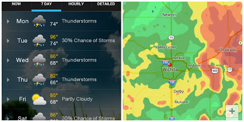
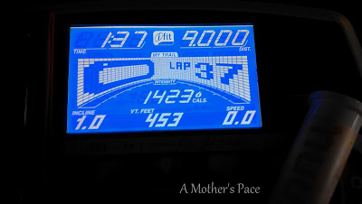

It's looked a lot like this around Wichita lately.  
  

  

It hasn't just been nice summer rain showers. It's been stormy with a lot of lightning and rain. It's great that the lakes are all filling back up but there's been some flooding in the area and it's definitely made running a challenge.  
  
I've been out [running in the rain](http://bit.ly/14yYVF1) a few times in the past couple of weeks but if there is lightning I'm not taking any chances.   
  
I kept delaying my long run this week. I usually like to wake up, eat a little snack and head out the door for a long run. This week it was storming (of course) and so I kept putting off my run hoping that the sun would come out. Or at least the downpour would stop.   
  
By 11:30 a.m. I couldn't avoid it any more and so I headed down to the treadmill.

  
  

  
The good thing about running long on the treadmill is that there is plenty of storage space for water, Nuun, and energy chews. And the Kindle Fire. I know there are plenty of runners out there that power through a long workout with no entertainment but I'm not one of them. I rely heavily on my Netflix subscription while running!  
  
I definitely set my treadmill distance record this week. 9 miles in 1 hour and 37 minutes which makes it a 10:46 pace.   
  
You know, it wasn't that bad. I made it through a little over 2 episodes of a Netflix show and then I was finished. I set the treadmill to go at a set 'long run' pace from [McMillan's Pace Calculator](http://bit.ly/130Uelt) and just ran.   
  
I'm a little amazed by how much I don't hate my treadmill!  
  
Would I run long again on the treadmill? Sure. I always say I prefer to run outside but running inside has some perks.  
  
It seems as though I ran the perfect distance this time around. A few minutes after finishing the 9 miles I was walking to cool down and my treadmill just shut down. The belt stopped, my data was gone. It was done. I guess I reached a time goal, maybe it was 1 hour and 45 minutes?   
  
I'm glad it happened though because now I'll know to reset my run in the middle when I run more than 9 miles so that I will be able to track all my data. I would have been super upset if I had just ran over 9 miles and then all the numbers were gone. Yep, I'm a numbers geek!  
  

  

**How do you keep yourself entertained on the treadmill? What's your distance record on the treadmill?**

\------------------------------------------

  

Staying at home with kids sounds easy, right? Life with 3 little ones is busier than I imagined. I don't write every day on the blog but I do update Facebook, Twitter and Instagram more often.   
  
Find A Mother's Pace on...  
  
Twitter [@amotherspace3](https://twitter.com/amotherspace3)  
  
Facebook [amotherspace3](http://facebook.com/amotherspace3)  
  
Instagram [amotherspace](http://instagram.com/amotherspace)  
  
Pinterest [amotherspace](http://pinterest.com/amotherspace/)  
  
RSS [amotherspace](http://feeds.feedburner.com/amotherspace)
