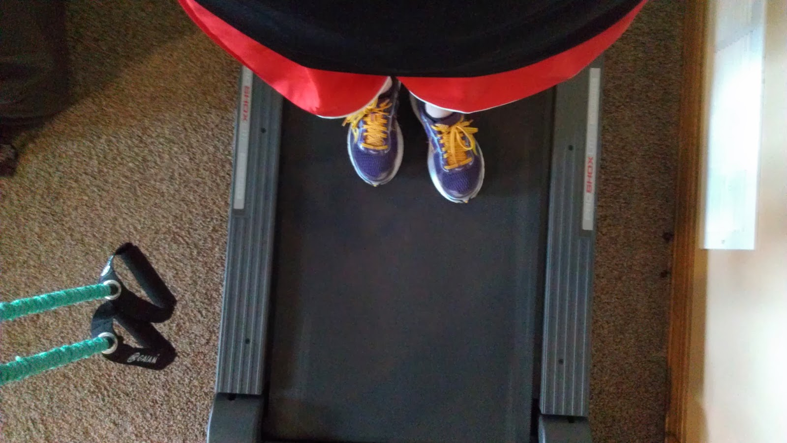
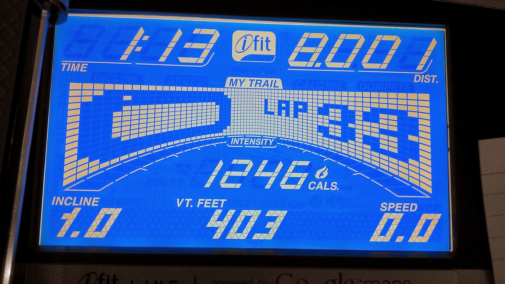
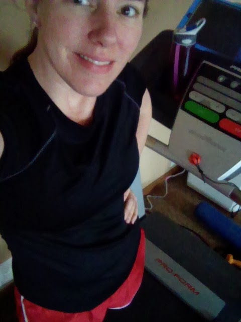
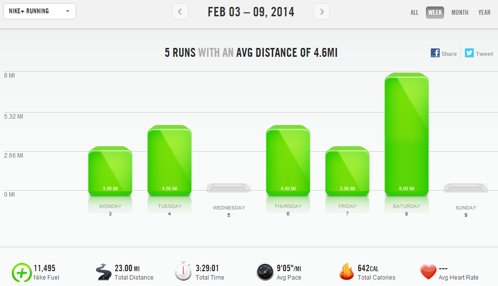

I've been running for many years (since junior high track) but I would always stay under the 5 mile mark. Maybe I ran more than that a few times during cross country in high school but mainly I kept the miles pretty low.  
  

  
Then in 2006 I decided to run a half marathon and I haven't really ever turned back. I vividly remember how hard that first ever 10 mile run was. So tough and I couldn't imagine adding 3.1 miles on top of that! But I did it and since then I've gone on to run a marathon.  
  
  

  
Why am I thinking back on my miles? I ran my long run on the treadmill this weekend. It wasn't that long of a run for me (8 miles) but it got me thinking back to the first few times that I had run that distance and how far I've come in the past several years.   
  
Back when I first started running longer distances I never would have imagined running 8 miles on a treadmill, for fun. Outside was hard enough so I didn't even consider the treadmill.   
  
This weekend I wanted to run outside but the roads and sidewalks were just too snowy and icy. It wasn't that tough of a decision to stay inside and run. Running for 1 hour and 13 minutes on a treadmill might not have been my first choice but I still enjoyed the run.   
  
  

  
9 miles is my personal distance record on the treadmill but probably not for long. I'm sure I'll have to take a long run inside at some point this year while I'm training for my spring half or my fall full and, strangely, I'm kind of looking forward to it.   
  
  

  
I think the reason why I wanted to write this all out was to remember how far I've come in my running journey. Running these longer distances during training is something I look forward to now and not something that seems as impossible as it once did.  
  
  
  

  
**Weekly Workouts**  
  
Monday: 3 miles (9:06 pace) + 25 minute Jillian Michaels Circuit + 6 minute Ab Challenge  
  
Tuesday: 4.5 miles (8:56 pace) + 15 minute NTC Leg Workout + 5 minute Yoga   
  
Wednesday: 20 minute Yoga + 7 minute Ab Challenge  
  
Thursday: 4.5 miles (8:55 pace) + 25 minute strength and Ab Challenge  
  
Friday: 3 miles (9:14 pace) + 15 minute NTC Back Definer Workout + 5 minutes Ab Challenge  
  
Saturday: 8 miles (9:07 pace)  
  
Sunday: 40 minutes climb intervals on the spin bike + 10 minutes Core Work  
  
  

  

  

Total Running Miles: 23  
Weekly Average Pace: 9:05  
  
February Running Miles: 28  
2014 Running Miles: 111.88  
2014 Running Kilometers: 180.05  
  
  
  
  

**What's something you've accomplished on your running journey?**

  

  

  

\-------------------------------

  

Find A Mother's Pace on...  
  
Twitter [@amotherspace3](https://twitter.com/amotherspace3)  
  
Facebook [amotherspace3](http://facebook.com/amotherspace3)  
  
Instagram [amotherspace](http://instagram.com/amotherspace)  
  
Pinterest [amotherspace](http://pinterest.com/amotherspace/)  
  
Bloglovin' [A Mother's Pace](http://www.bloglovin.com/en/blog/6680087)  
  
RSS [amotherspace](http://feeds.feedburner.com/amotherspace)
