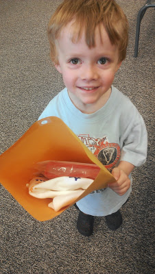
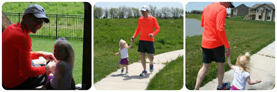
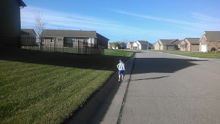
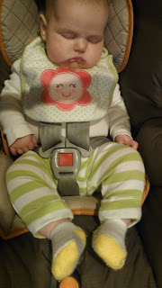

Last weekend Little O went with me to sign up for his first race! It's a 1 mile fun run/walk and I couldn't be more excited about it.   

  

  

Luckily, he's pretty excited about it too. He even got his own race packet!

  

Little A will be running also and Little E will be in the stroller. It's our first family race and hopefully there will be many more to follow.

  

Both kids have shown some interest in running lately. Recently Little A put on her running skirt and shoes to join Daddy after he finished with his run. 

  

  

So cute!

  

Little O likes to run ahead during family walks.

  

  

And Little E will have to wear her running socks. 

  

  

  

  

**Has your family raced or done a fun run together? At what age did you first sign up your children for a race?**

  

  

  
  
  
\------------------------------------------

  

  
Find A Mother's Pace on...  
  
Twitter [@amotherpace3](https://twitter.com/amotherspace3)  
  
Facebook [http://facebook.com/amotherspace3](http://facebook.com/amotherspace3)   
  
Instagram [amotherspace](http://instagram.com/amotherspace)  
  
RSS [amotherspace](http://feeds.feedburner.com/amotherspace)
