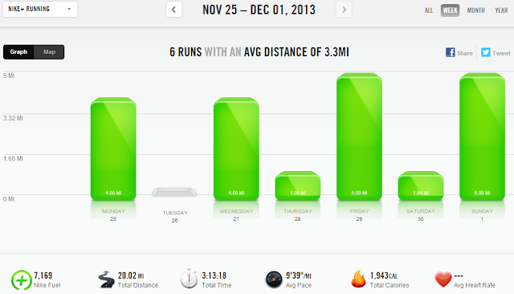

My sister was in town last week for my daughter's birthday and Thanksgiving. My kids love their Auntie (and her husband, of course!!) and so we had a fun week of building (and rebuilding) train tracks, playing hide and seek, reading books and just being silly.   
  
We were sad to see them go yesterday but I'm glad that throughout the week we were able to get a couple of runs in together.   
  

  
Our first run together was a chilly 3 miler. I'm so proud of my sis for running 3 miles! She occasionally runs (and has ran an 8k before, the Shamrock Shuffle in Chicago!!) but hasn't really been running lately. She rocked the 3 miles and I finished the run with a mile of strides.   
  

  
Next up (a couple days later) we ran a short mile in the neighborhood to keep the Runner's World run streak going. (More on the streak later on in the week!)  
  
Having my sister in town and getting to run with her made for a fun week all around!  
  
  
  
  

  
**Weekly Workouts**  
  
Monday: 4 easy miles (10:57 pace)   
  
Tuesday: Rest Day  
  
Wednesday: 4 miles (9:23 pace)  
  
Thursday: 1 mile (9:04 pace)  
  
Friday: 5 miles (9:29 pace)  
  
Saturday: 1 mile (10:12 pace)  
  
Sunday: 5 miles for the 5 and 10 race series (8:59 pace)  
  

  
  
Total Running Miles: 20.01  
Weekly Average Pace: 9:39  
  
November Running Miles: 72.05  
December Running Miles: 5  
2013 Running Miles: 512.06  
  
  
  

**Do you ever run with siblings?** 

  

\-------------------------------

  

Find A Mother's Pace on...  
  
Twitter [@amotherspace3](https://twitter.com/amotherspace3)  
  
Facebook [amotherspace3](http://facebook.com/amotherspace3)  
  
Instagram [amotherspace](http://instagram.com/amotherspace)  
  
Pinterest [amotherspace](http://pinterest.com/amotherspace/)  
  
Bloglovin' [A Mother's Pace](http://www.bloglovin.com/en/blog/6680087)  
  
RSS [amotherspace](http://feeds.feedburner.com/amotherspace)
