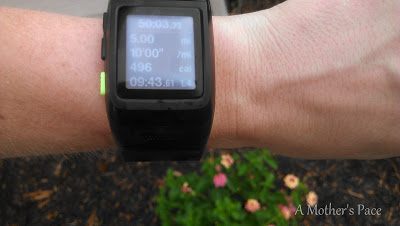
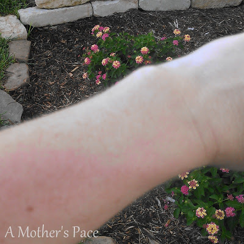
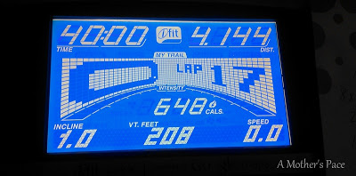

This week my sport watch finally gave out on me.   
  
(I guess I shouldn't say finally because I've only had it for 13 months and out of those I wasn't running for about 6 months because of pregnancy/postpartum recovery.)  
  
So after my [**downpour run**](http://bit.ly/1davr2G) a few weeks ago I noticed some moisture under the display but the watch was still working well. It's water resistant but, of course, you're not supposed to swim with it. Well, I suppose 8 miles of heavy rain was just a bit much and my watch finally gave up.  
  
  

  
Nike+ has an amazing service center and even though it's not technically under warranty anymore they are going to check it out and see if I'm eligible to receive a replacement. My fingers are crossed.  
  
I'm stuck without a watch until my replacement comes or a I have to buy a new one. I'm still tracking miles and overall pace with the Nike+ app on my phone but it doesn't give me the constant feedback that I'm used to.  
  
  

  
It's probably good for me. I've been addicted to my watch for some time now and I'm hoping that this week or two of running without one will teach me to be more aware of the effort behind my pace.  
  
Speed work is challenging until I get another watch. If I run outside I just have to guess both the time of my run and the pace I'm trying to hit. That's why this morning I decided to run on the treadmill instead. I have a clock right there and the treadmill sets the pace for me.   
  
Here's my morning treadmill workout.  
  
10 minute warm up at 5.6-6.0 mph (10:43-10:00 pace)  
8 x 1 minute at 6.3-7.1 mph (9:31-8:27 pace)  
2 minute recovery in between 6.0-6.4 mph (10:00-9:23 pace)  
10 minute cool down at 6.0 (10:00 pace)  
  
Time: 40 minutes  
Distance: 4.14 miles  
Average Pace: 9:39  
  
  

  
This workout is straight from the [Train Like a Mother](http://amzn.to/10eETuP) Half Marathon Finish It Plan. It was a fun but challenging workout.   
  

**What GPS watch do you use? If I have to buy a new one should I stay with Nike+ or switch to a Garmin?**

  
Linking up today with [Jill Conyers](http://bit.ly/19CdmGN) and [Running Bloggers](http://bit.ly/19CdcPC) for Fitness Friday.   

\------------------------------------------

  

Staying at home with kids sounds easy, right? Life with 3 little ones is busier than I imagined. I don't write every day on the blog but I do update Facebook, Twitter and Instagram more often.   
  
Find A Mother's Pace on...  
  
Twitter [@amotherspace3](https://twitter.com/amotherspace3)  
  
Facebook [amotherspace3](http://facebook.com/amotherspace3)  
  
Instagram [amotherspace](http://instagram.com/amotherspace)  
  
Pinterest [amotherspace](http://pinterest.com/amotherspace/)  
  
Bloglovin' [A Mother's Pace](http://www.bloglovin.com/en/blog/6680087)  
  
RSS [amotherspace](http://feeds.feedburner.com/amotherspace)
