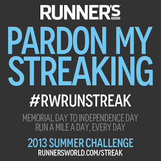
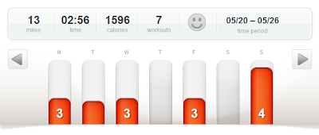

  
I might just be going crazy but I've decided to join the Runner's World Summer Run Streak. What does this mean? I'm going to run _at least a mile_ every day between Memorial Day and Independence Day. That's 39 days total. Pretty crazy since my last running streak was probably 5 days, maybe.   
  
Even more crazy is that I'm training to run two half-marathons. One in September and one in October. That means that some of these miles will be very _slow_ on 'rest' days.   
  
But I'm in. It sounds like fun so I can't resist. Wish me luck!  
  
  

  
With a new route and race day, running this week was pretty fun. My postpartum (3 months!) pace is getting closer to pre-pregnancy. I ran a 10:15 easy run on Friday which is a little closer to the 9:30 easy run pace I'm used to. Baby steps, right?  
  
The Get Your Rear in Gear 5k and Fun Run was last night and really was so much fun. Our first race as a family! I'm working on my recap and will have it up for you tomorrow!  
  
  
Workouts from last week:  
  
Monday  
Evening Family Walk  
Sworkit Upper Body: 15 min  
  
Tuesday  
3 Mile Run w/ 4 strides  
Sworkit Core Workout: 15 min  
  
Wednesday  
3 Mile Run w/ last 1/3 at tempo  
  
Thursday  
Rest   
  
Friday  
3 Mile Run  
  
Saturday  
Rest  
  
Sunday  
1.07 Mile Fun Run  
3.15 Get Your Rear in Gear 5K  
  
  
  

**What is your running streak? Ever participated in a Runner's World streak before?**

  

  
  
  

\------------------------------------------

  

  
Find A Mother's Pace on...  
  
Twitter [@amotherpace3](https://twitter.com/amotherspace3)  
  
Facebook [http://facebook.com/amotherspace3](http://facebook.com/amotherspace3)   
  
Instagram [amotherspace](http://instagram.com/amotherspace)  
  
RSS [amotherspace](http://feeds.feedburner.com/amotherspace)
