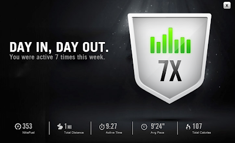
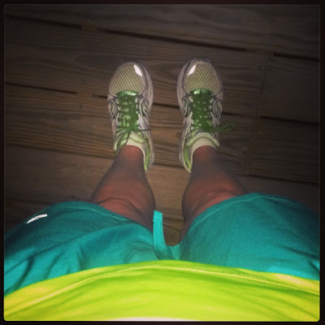
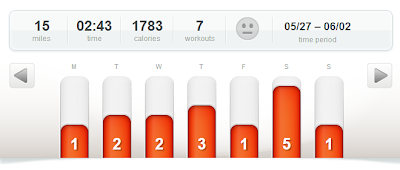

8 days in for the #RWRunStreak and still going strong. I earned this   
  
  

  
from Nike+ all because of the run streak. I'm pretty sure that 7 days in a row is my longest streak ever. But I'm not done yet!  
  
  

  
A few things I've learned from streaking:  

- Running for 1 mile is fun. 
- I'm still enjoying each and every run, even if I'm not excited to run before I get out there. **I never regret a run.**
- It's hard to get motivated to run in the evening. On busy days I just have to do it anyway. **I never regret a run.**
- Running daily creates quite a bit more laundry. I have 3 sports bras that are comfortable for me (as a nursing mother, comfort is my top priority!!) so I have to wash running clothes at least every 3 days. This will make laundry during vacation interesting!

<table align="center" cellpadding="0" cellspacing="0"><tbody><tr><td></td></tr><tr><td>Short on clean clothes? Matching is overrated anyway, right?</td></tr></tbody></table>

  

I've decided to start tracking my pace from each run on my weekly training log. Hopefully this will show that my pace average is going down over the weeks and months ahead. 

  

  

**My Running from Last Week**

  

Monday: 1 mile run (11:04 pace)

  

Tuesday: 2 mile run (11:10 pace)

  

Wednesday: 2 mile run (11:13 pace)

  

Thursday: 3 mile run (10:41 pace)

  

Friday: 1 mile run (9:19 pace)

  

Saturday: 5 mile run (11:09 pace)

  

Sunday: 1 mile run (9:24 pace)

  

Total Running Miles: 15

  

  

<table align="center" cellpadding="0" cellspacing="0"><tbody><tr><td></td></tr><tr><td>I never regret a run.</td></tr></tbody></table>

  

  

  

**Anyone else streaking? What have you learned in the first week?** 

  

  

  

  

  

\------------------------------------------

  

  
Find A Mother's Pace on...  
  
Twitter [@amotherpace3](https://twitter.com/amotherspace3)  
  
Facebook [http://facebook.com/amotherspace3](http://facebook.com/amotherspace3)   
  
Instagram [amotherspace](http://instagram.com/amotherspace)  
  
RSS [amotherspace](http://feeds.feedburner.com/amotherspace)
