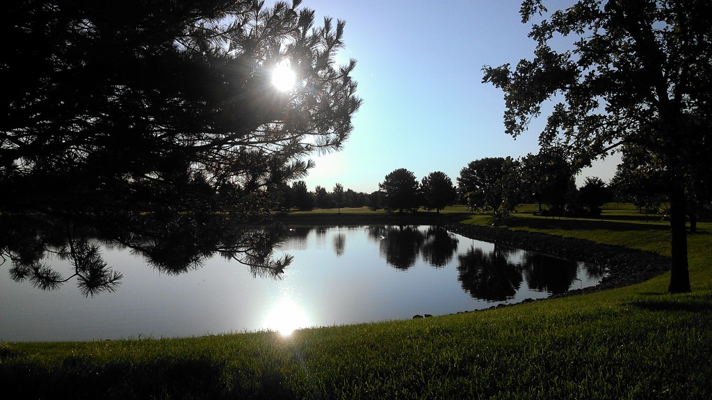
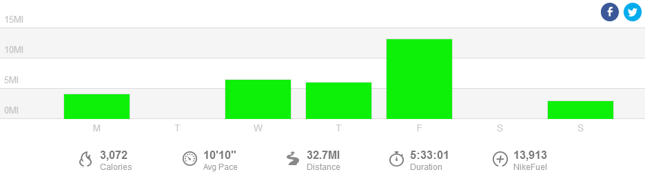

 

This week I had to pick safety over convenience when going out for a run. My neighborhood is surrounded by busy streets with no sidewalks. With mileage building on multiple runs throughout the week I had to figure out an easier way to run out of my neighborhood.

My run on Thursday morning only made this even more apparent. I was headed home on a very narrow, basically nonexistent shoulder, and the cars were just flying by me and not moving over like normal. People are serious about getting to work! I had to stop a couple of times and wait for cars to pass. I've never liked running on this street but running it when the sun was rising at that point was dangerous. I don't think that they could really see me.

The next day I decided to run on a street that is actually busier but has a wider shoulder. I felt much safer and actually I wish that I had thought to do this a long time ago. After running on it twice now, I've ducked into neighborhoods off of this street that I've never been in before. It's fun to explore and find new areas so close to home!

 

 

I stumbled upon the little pond above and enjoyed my entire run. It's much better than having to dread a specific stretch of road for the entire run!

 

 

## **Weekly Workouts**

 

**Monday:** 4.05 miles (10:15 pace) + 10 minutes strength

I'm cutting it close lately with my timing of getting a run in before my husband heads to work. My schedule said an easy 4-5 miles and I squeezed in the 4 but didn't have quite enough time to get in all the strength moves that I wanted.

**Tuesday:** 60 Minutes Spin Bike

It was rainy and my sidewalks were flooded on my normal route so I ultimately decided to switch my cross training day and my scheduled Tuesday run. It couldn't have worked better because the weather on Wednesday was beautiful!

**Wednesday:** 6.5 miles (9:45 pace)

I woke up to 60 degree weather and headed out for a run that was a good 15 degrees cooler than I'm used to right now. There were still muddy patches and large rain puddles to dodge but the gorgeous morning out was well worth it.

**Thursday:** 6.05 miles (10:09 pace)

Another cool day today, in fact it was in the high 50's so I actually ran in capris! This was first run on my new route and it made the entire run more exciting and enjoyable.

**Friday:** 13.15 miles (10:26 pace)

Another long run on a Friday! My husband was off of work for the 4th of July so I took advantage of the extra time and got running out of the way before a busy weekend. As soon as I returned we loaded up the bikes for a 1 mile+ ride on our way to the neighborhood pool. That's my version of a triathlon! The cool water in the pool felt so good on my tired legs. Maybe this means I need to try an ice bath soon?

 

 

**Saturday:** Rest Day

**Sunday:** 3 miles (9:47 pace)

Woke up late but still managed to squeeze in 3 miles. My legs are feeling a little tired (especially my right calf and achilles) but after I get started it feels much better.

 

 

One of my main goals for 2014 is to Run This Year in kilometers. That's 2,014 kilometers or 1,251.44 miles.

Weekly Running Miles: 32.75

Weekly Average Pace: 10:09

July Running Miles: 28.70

2014 Running Miles: 643.82

2014 Running Kilometers: 1036.13

 

**Is it convenient for you to run right from your house? Do you drive somewhere to run?**

 

\_\_\_\_\_\_\_\_\_\_\_\_\_\_\_\_\_

I’m running the Chicago Marathon with Team RMHC!

To find out more read my post about [Running for Charity](http://amotherspace.net/2014/06/the-chicago-marathon-running-for-charity/) or head over to my [fundraising page](http://www.kintera.org/faf/donorReg/donorPledge.asp?ievent=1097960&supId=399266070) to make a donation.

——————————-

Find A Mother’s Pace on…

Twitter [@amotherspace3](https://twitter.com/amotherspace3)

Facebook [amotherspace3](http://facebook.com/amotherspace3)

Instagram [amotherspace](http://instagram.com/amotherspace)

Pinterest [amotherspace](http://pinterest.com/amotherspace/)

Bloglovin’ [A Mother’s Pace](http://www.bloglovin.com/en/blog/6680087)

RSS [amotherspace](http://feeds.feedburner.com/amotherspace)
