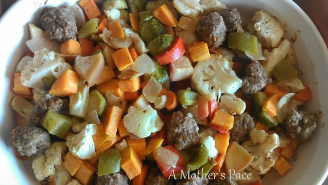
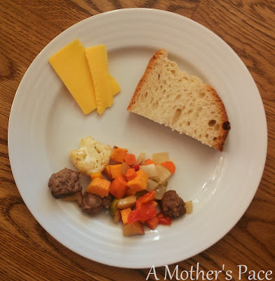

Every now and again I come across something that we are enjoying so much that it's hard not to share it with you.   
  
  

  

  
Sausage Bake is easily one of my favorite meals lately. It was a meal that my sister and her husband made for us while visiting a while back. They follow the paleo diet and we were having our brother over as well. He follows a vegan diet.   
  
Do you see the problem here??? Trying to find a meal that will work for both the vegan and the paleo diet is not an easy task. This turned out to be the perfect meal. Filling and oh so tasty.   
  
We've made this dish several times over the past few months and made it our own.   
  
Have I mentioned it's super easy?  
  
Just chop up some veggies so that they are the same approximate size. We used sweet potato, brussels sprouts, cauliflower, onion, red pepper, green pepper, carrot and apples this time around. Use any veggies that you like but don't leave out the apples, they make the dish!  
  
Place the veggies and apples in a baking dish. We usually use a jelly roll pan, but any dish will do. But don't pile them on too high. They should be spread out so they roast well.  
  
Drizzle a small amount of olive oil and sprinkle some salt and pepper.  
  
For the meat eaters, ball up the sausage into small chunks and place on top of the veggies. We usually use half a pound of sausage.  
  
Repeat for the vegan dish but leave off the meat, of course.  
  
Bake for about 30-40 minutes at 375 degrees.   
  
This week we paired the Sausage Bake with some cheese and some tasty bread to complete our meal. As you can tell we are neither vegan or paleo!   
  
Enjoy!  
  
  

**Have you cooked a vegan/paleo friendly meal? What is your favorite meal lately?**

  

  

\----------------------------------

  
Find A Mother's Pace on...  
  
Twitter [@amotherspace3](https://twitter.com/amotherspace3)  
  
Facebook [amotherspace3](http://facebook.com/amotherspace3)  
  
Instagram [amotherspace](http://instagram.com/amotherspace)  
  
Pinterest [amotherspace](http://pinterest.com/amotherspace/)  
  
Bloglovin' [A Mother's Pace](http://www.bloglovin.com/en/blog/6680087)  
  
RSS [amotherspace](http://feeds.feedburner.com/amotherspace)
