I've been training for this race for the past 3 months. It always seemed so far off and then suddenly it was here.  
  
I've logged over 224 training miles and raised just over $1,500 for the Leukemia and Lymphoma Society (LLS) so I knew the day was coming but I must have been in denial or something. You see, this is the first big race that I have trained for that I haven't expected to set a personal record (PR).   
  
  

[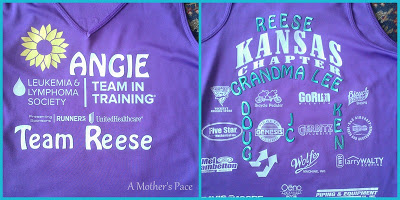](http://amotherspace.net/wp-content/uploads/2013/09/TNT+Jersey1.jpg)

  
It was also a race that I was running not for myself but for those on the back of my jersey. I mentioned above that I raised funds for LLS. It is a charity that is near and dear to my heart because so many of those that I love have been affected by a blood cancer.   
  
  

<table align="center" cellpadding="0" cellspacing="0"><tbody><tr><td><a href="http://4.bp.blogspot.com/-INMXysSv27I/UjdN_qtFDzI/AAAAAAAAO5w/S8etaZFWBdg/s1600/IMAG0237.JPG" imageanchor="1">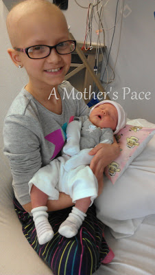</a></td></tr><tr><td>Reese during a transfusion with our Little E at 4 days old.</td></tr></tbody></table>

This year I ran for my niece, Reese. She's 10 years old and currently undergoing maintenance therapy for Acute Lymphocytic Leukemia (ALL). She was initially diagnosed just before her 4th birthday and after 2 years cancer free, she relapsed in 2012. Reese is my hero. She's incredibly brave and an amazing young lady.   
  
I also ran in memory of my Grandma and in honor of my husbands uncle and two family friends.   
  
The night before the race I opened my computer to take a look at the course. I know, last minute. I knew the general area before and there are no hills to speak of here so I didn't really have to worry about training for anything specific. Anyway, I looked at the course and couldn't have been more excited about it.  
  
  

[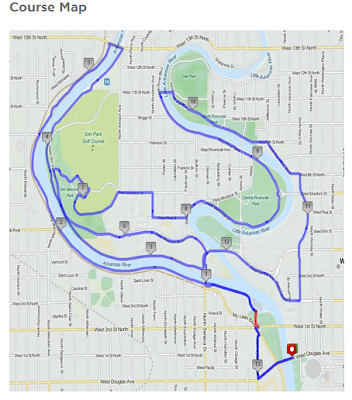](http://3.bp.blogspot.com/--ZYWfS5BDNQ/UjdYM4liP2I/AAAAAAAAO6g/jQ3mHqahGZU/s1600/SJRCourseMap.PNG)

  
I used to live in the Riverside area before I got married and I ran these streets all the time. I've ran races in the area before but they usually just covered parts of the park but this one took me down all of my favorites. Looking at the map got me pumped for the race.   
  
It's just such a beautiful area. We ran by the river and even directly in front of one of my old houses. I had a huge grin on my face for a big chunk of the race simply because I was enjoying _where_ I was running so much.  
  
Race day was gorgeous. It was low 60's at race start. Ideally, I would love for 45 degrees but 60's was much better than the mid 70's mornings we've been having. There was even a light cool breeze. I'll take it!  
  
  

<table align="center" cellpadding="0" cellspacing="0"><tbody><tr><td><a href="http://amotherspace.net/wp-content/uploads/2013/09/IMAG2443-11.jpg" imageanchor="1">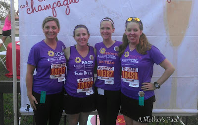</a></td></tr><tr><td>Representing Team Reese!</td></tr></tbody></table>

We started off the morning meeting up with fellow Team in Training teammates. Overall our entire team (more than just Team Reese in the photo above) raised over $10,000 for LLS!! For this race, Team Reese included my two sister-in-laws, myself and a family friend. _Stay tuned for more Team Reese members at a race in October._   
The race started and some TNT members stuck together but I had decided ahead of time to run my own race. One of the best things about running in a TNT event is that I had coach support during the race. One of our coaches ran back and forth between all of our runners to give moral support and make sure everyone was doing o.k. She ran with me 3 times and it really helped to give me just a bit more energy to get me through the race.  
  
My family was at mile 5 waiting to cheer me on. They are an amazing crew of supporters!   
  
  

[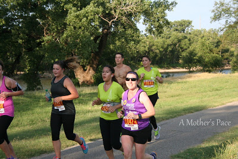](http://2.bp.blogspot.com/-0G-5ZbEuHfY/Ujde-75hPMI/AAAAAAAAO7E/udooRT9GfBo/s1600/IMG_8932.JPG)

  
I stopped for a couple of quick kisses.  
  
The water stops were every two miles which ended up being great. During training I ran with my hydration pack but I didn't want to cover up my jersey for this race. I was worried about not getting enough water (and I know I didn't drink as much as I do with the pack) but the stops worked out perfectly.   
  
I took two Honey Stinger gels. One before the 4 mile water stop and another before the 8 mile stop. I also ate part of a GU that was handed to me at the 10 mile stop.  
  
My intention for pacing was to stay at 10:30 as a warm up for a couple of miles and then bump up the pace to 9:30 for the bulk of the race and then towards the end try to aim for 9:00. 
  
  

[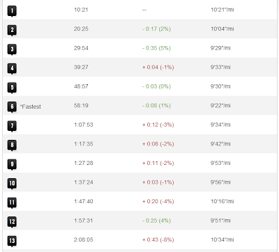](http://2.bp.blogspot.com/-w66_iIljd7A/UjddsFnMaSI/AAAAAAAAO64/wLKO5JY-vBw/s1600/SJRSplits.PNG)

  
It didn't really happen like that and I hate that the last mile was my slowest but my overall pace of 9:53 was much better than I had anticipated a couple of weeks ago. I never made it close to the 9 minute mile pace but I learned a lot about pacing during this race and the good news is that I get to try again in just 4 weeks!   
  
My husband met me around 13 miles to help bring me in. I'm so glad he did because it gave me an extra burst at the end. That last mile was tough!  
  
  

[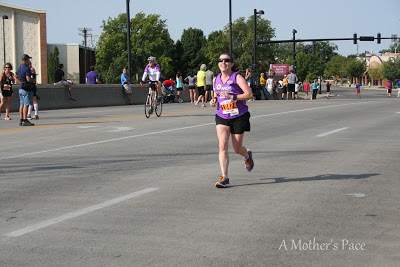](http://4.bp.blogspot.com/-1L-SRtJUBA8/UjdfBu0-iqI/AAAAAAAAO7o/vbZO2EQbjYI/s1600/IMG_8980.JPG)

  

[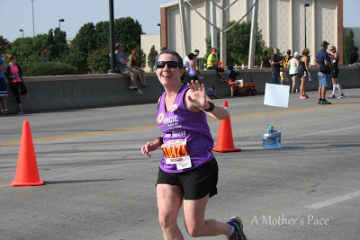](http://1.bp.blogspot.com/-grn0Iw82JxE/UjdfCPle4jI/AAAAAAAAO7s/fm-Y52QQ1L0/s1600/IMG_8986.JPG)

  
I had some of the best cheerers out on the course!  
  
  

[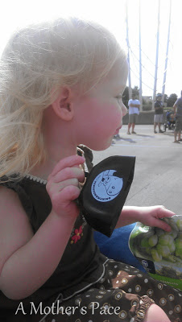](http://3.bp.blogspot.com/-1VZBFXOHbw0/UjdfAOFovyI/AAAAAAAAO7g/kAiw8WGvOHo/s1600/IMAG2452.JPG)

  
And finished. The time for my 4th half marathon: 2:09:27:7  
  
  

[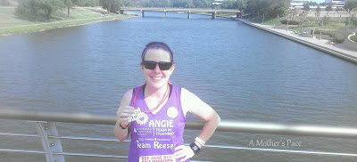](http://3.bp.blogspot.com/-cvXugN9LVRM/Ujde_6u-PUI/AAAAAAAAO7U/I6_XoKvYGBE/s1600/IMAG2446-1.JPG)

  
This wasn't my A goal for the race but honestly, I'm so happy with it. Because training has been so challenging for me after having a baby six months ago I really was preparing myself for a PW (personal worst) but instead I'm only 5 minutes shy of my PR time. Not too shabby!  
  
  

[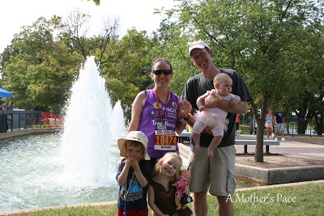](http://1.bp.blogspot.com/-NxJUHOppQrw/UjdfCeqS6SI/AAAAAAAAO74/ojjC6K2u3is/s1600/IMG_9007.JPG)

  
I couldn't do a race like that without the support of my family. It means the world to me to have them out there with me on race day!  
  
  

  
With champagne and chocolates at the finish, a beautiful course, top notch support throughout the race and all race entries benefiting LLS, See Jane Run was a fabulous race and I'm so glad that I was able to participate in it.  
  
See Jane Run Half Marathon Results  
  
Official Time: 2:09:27:7  
Nike+ Time: 2:09:25  
Official Distance: 13.1 miles  
Nike+ Distance: 13.14  
Official Pace: 9:53  
Nike+ Pace: 9:51  
Overall Placement: 152/525  
Age Placement (35-39): 33/104  
  
  

[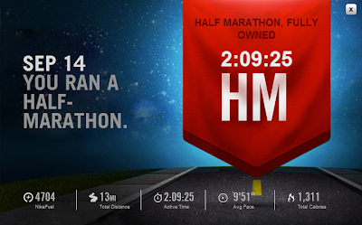](http://2.bp.blogspot.com/-SSBfCEn4JrQ/UjdVhVC6XFI/AAAAAAAAO6I/lHMpeGCZjN8/s1600/Nike+HalfMarathon.PNG)

  
Are you interested in running with Team in Training to help raise funds for LLS? Find out more on their [**website**](http://teamintraining.org/).  
  
Another way to help is through a simple app on your phone. Download [**Charity Miles**](http://www.charitymiles.org/) and start collecting funds for a charity of your choice (LLS!!) simply by recording your run, walk or bike ride. I raised an additional $3.33 during my half marathon just by turning on the app while running. So simple! #everymilematters  
  
  

[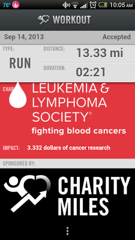](http://amotherspace.net/wp-content/uploads/2013/09/Screenshot_2013-09-15-10-05-461.png)

  
I've raced everything from a 5k to a marathon over the past several years. For more race recaps visit my [Racing](http://bit.ly/17BCg8S) page.  
  
  

[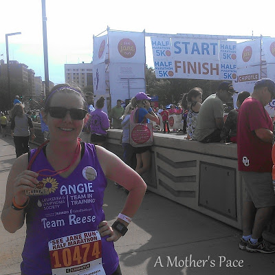](http://3.bp.blogspot.com/-pXlNH1bx22o/UjdfARCKoaI/AAAAAAAAO7w/--xkppm7uLk/s1600/IMG_20130915_045123.JPG)

  
  
  

**Are you a Team in Training Alumni? What race did you participate in? What TNT race do you want to do in the future?** 

  
  

I've linked up with [Jill Conyers](http://jillconyers.com/2013/09/25-healthy-soup-menus/) for Fitness Friday.   
  
  

\------------------------------------------

  

Staying at home with kids sounds easy, right? Life with 3 little ones is busier than I imagined. I don't write every day on the blog but I do update Facebook, Twitter and Instagram more often. 

  
Find A Mother's Pace on...

  
Twitter [@amotherspace3](https://twitter.com/amotherspace3)

  
Facebook [amotherspace3](http://facebook.com/amotherspace3)

  
Instagram [amotherspace](http://instagram.com/amotherspace)

  

Pinterest [amotherspace](http://pinterest.com/amotherspace/)

  

Bloglovin' [A Mother's Pace](http://www.bloglovin.com/en/blog/6680087)

  

RSS [amotherspace](http://feeds.feedburner.com/amotherspace)
