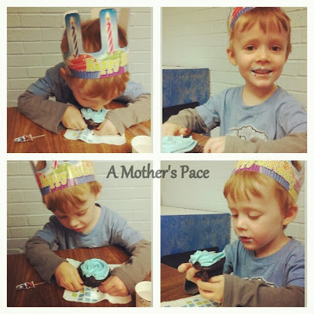
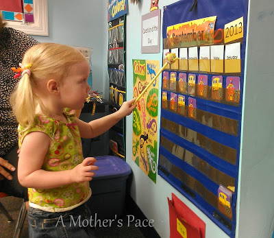
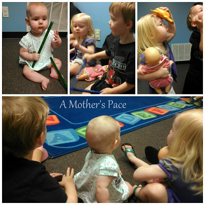
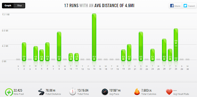

And now we're in October. It doesn't really feel like October yet here in Kansas. Most of the leaves on the trees are still green. We've had a couple cool days but most of them are still in the high 80's. The mornings are much cooler though and I'm enjoying the nice running weather. Temps in the low 50's = perfect running conditions in my book.  
  
September was a good month both for running and my family. Here's a look back at some highlights:  
**Mothering Moments**  
There are so many things going on with all of my kids but I'm just going to pick my favorite milestone of the month for each one of them.  
  
This little guy turned 4 in September.   
  
  

  
It's truly been the best 4 years of my life. He's an amazing little boy with such a fun personality. I'm so blessed to be his mommy!   
  
Little O is not the only one that is going to school. We all go to a parent participation preschool class one morning a week and Little A is loving it.   
  
  

  
Little E is SO CLOSE to crawling. I'm always afraid when I leave her with someone that I'll miss her crawling for the first time.   
  
  

  
**Racing/Training in September**  
  
I ran Wichita's **[See Jane Run Half Marathon](http://amotherspace.blogspot.com/2013/09/see-jane-run-half-marathon-wichita-race.html#.Uksb1oZQEYk)** last month. I'm very happy with the outcome of the race, especially since it was my first big race after my pregnancy.  
  
Training isn't over though. My next half marathon is coming up soon in just under two weeks!  
  
  
**A Few of my Favorites from A Mother's Pace**  
  
**[A Day in the Life](http://amotherspace.blogspot.com/2013/09/a-day-in-life.html#.Uksd2IZQEYk)**  
Take a peak behind the scenes during one of my days recently. This post was FUN to write and also fun to look back on. Already, and it's only been a couple of weeks.   
  
  

  
**[A Labor Day #bestrun + 5 and 10 Virtual Race Series](http://amotherspace.blogspot.com/2013/09/a-labor-day-bestrun-5-and-10-virtual.html#.Uksd3oZQEYk)**  
My most motivating (not including race day) run of the month. This run gave me the confidence to run much faster than I had anticipated during my recent half marathon.   
  
**[Motivation and a Stroller Run](http://amotherspace.blogspot.com/2013/09/motivation-and-stroller-run.html#.Uksd6oZQEYk)**  
The people I've met throughout the running community are an amazing group. They motivate me in so many ways!  
  
  
**Favorite Running Gear**  
  
I've been loving the Nike Training Club (NTC) app on my phone. For the longest time I was always stuck on doing my favorite (Kara Goucher's Pro Stretching Routine) but now I've branched out and done quite a bit more. I've been doing 15 minute exercises that focus on either the arms, core or legs several times a week and I've loved every one of them.   
  
The only downside is that it's hard to hold my 7 month old baby after my arms are jelly when I complete an arm workout. Haha!   
  
If this sounds interesting definitely search for it in your app store on your phone...it's free!  
  
**Workouts in September**  
  
  

  
Total Running Miles: 78.78  
Treadmill Miles: 26  
Stroller Miles: 3  
Average Pace: 10:06  
  
Total Running Miles for 2013: 377.94  

  

  
  

\------------------------------------------

  

Staying at home with kids sounds easy, right? Life with 3 little ones is busier than I imagined. I don't write every day on the blog but I do update Facebook, Twitter and Instagram more often.   
  
Find A Mother's Pace on...  
  
Twitter [@amotherspace3](https://twitter.com/amotherspace3)  
  
Facebook [amotherspace3](http://facebook.com/amotherspace3)  
  
Instagram [amotherspace](http://instagram.com/amotherspace)  
  
Pinterest [amotherspace](http://pinterest.com/amotherspace/)  
  
Bloglovin' [A Mother's Pace](http://www.bloglovin.com/en/blog/6680087)  
  
RSS [amotherspace](http://feeds.feedburner.com/amotherspace)
