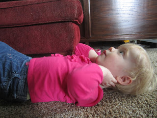
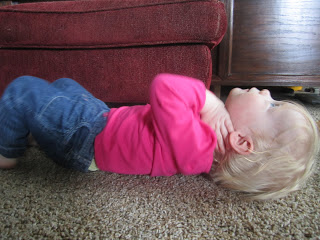
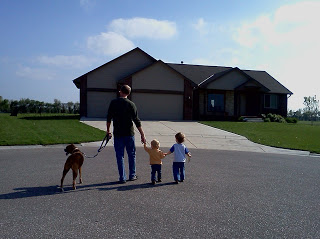
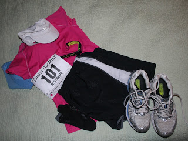

A loves to do her sit ups! Here she is working out with me during my strength training today. She counts out loud too!  

 We threw in a couple of grunts for fun....it was a tough work out after all!  

Today was a rest day from running but we did get a nice walk in after my husband got off work. The kids like to stretch their legs and get out of the stroller at the end of our walk each day. What a beautiful afternoon!

  

The Easter Sun Run 10K is tomorrow! I'm ready to race!

  

