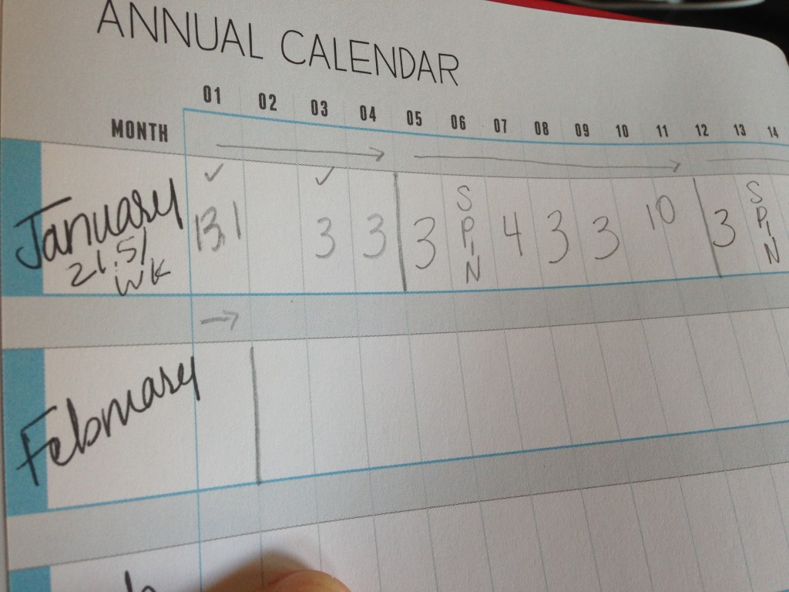
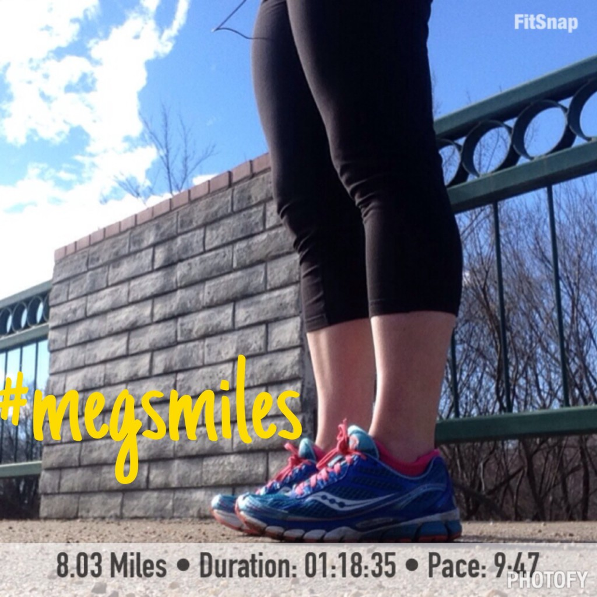
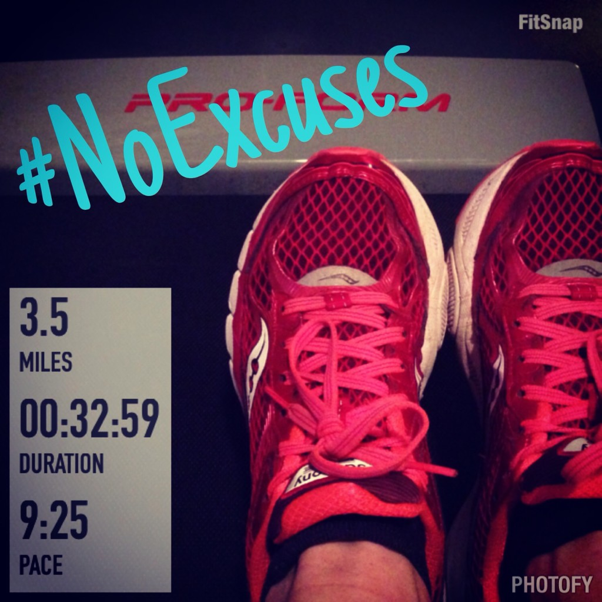
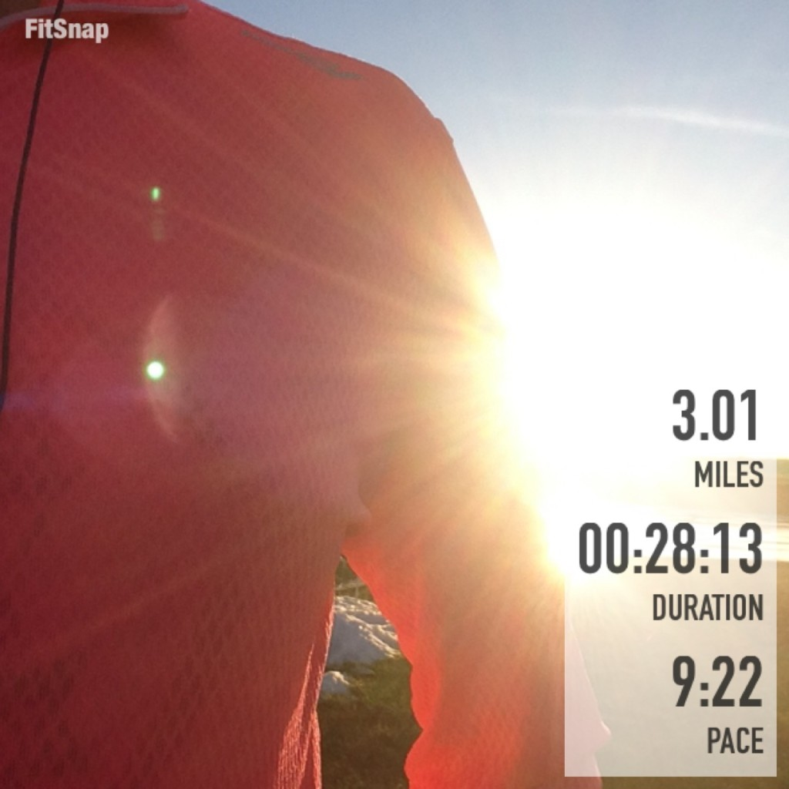

Lately I've been trying to sneak in a few extra miles. It hit me the other day that if I add in an extra half mile to just two of my runs a week it will give me 52 extra miles for the year. As much as I'm telling myself that I'm not going to hit 2,015 kilometers for the year again without training for a marathon, it's hard not to at least start the year out trying!

Now, I'm not currently training for a race but I still write out a running plan each week. My January goal is to run at least 105 miles. Lately my schedule is Monday: 3 miles, Tuesday: Cross Train, Wednesday 4 miles, Thursday 3 miles, Friday 3 miles and Saturday 8-10 miles.

I'm feeling great lately during my running and so why not add a little more? It's much easier to add that .5 miles on the treadmill because I don't have to plan a route ahead of time. I just assess how my run is when I've hit my goal mileage for the day and if I feel like adding in a bit more, I keep running.

I feel like I'm starting to get in the treadmill groove for the winter. I don't mind it for the shorter distances and it gives me a great excuse to watch t.v. in the morning. Even though I say I don't mind it, when the weekend rolls around and I have the opportunity to run outside I appreciate it even more than normal!

## #megsmiles

 

On Saturday I ran my long run of the week in honor of Meg just like I did last year. Here is some information that I found on a [webpage](http://www.run4meg.com/) in her honor:

Meg Cross Menzies was tragically killed by a drunk driver while out for her morning run on January 13, 2014. As an avid runner, member of the Richmond Road Runners Club, and Boston marathoner, she was a member of the running family nationwide. In her honor, our hope is to raise awareness of drunk driving, texting and driving, and overall safety of runners and cyclists everywhere. 

I'm amazed by the amount of support that I saw on Facebook, Instagram and Twitter in honor of Meg. I hope that it does a little to make people more aware of their actions. It frustrates me when I see people driving down the street with their smart phone in hand and looking at it while they are driving. So I laced up my shoes (I picked my blue shoes, Meg's favorite color, in her honor) and headed out the door.

## #NoExcuses

Last week was the first week of the No Excuses SweatPink challenge. There's still time to [join in on the fun](%20http://bit.ly/1yCAQLl) if you haven't already! Every Sunday you will be emailed the prompts for the week but most importantly the goal is to inspire and motivate each other with #NoExcuses. Last week we ran, did burpees, squats and showed a healthy snack. This week we are doing mountain climbers, pushups, taking the stairs, lunges and sharing a healthy snack.

## **Weekly Workouts**

**Monday:** 30 minutes Spin + 15 minutes Strength

Quick Strength for Runners #11 with spinning as a warm up. My legs were heavy from running in snow on Sunday so I switched my normal Tuesday workout to Monday.

**Tuesday:** 3.5 miles (9:25 pace)

Added an extra .5 mi to my run today on the treadmill.

**Wednesday:** 4.5 miles (9:24 pace)

12 min warm up on treadmill, 30 min QSFR #12, back on treadmill to finish the miles. Added an extra .5 mi to this run as well.

**Thursday:** 3.5 miles (9:31 pace)

This one was a hard treadmill run mentally for some reason. I still added an extra .5 miles to my run.

**Friday:** 3.01 miles (9:22 pace) + 20 minutes Core Work

An outside evening run. It was unseasonably warm and so I had to take advantage of it and run outside after my husband finished work for the day.

**Saturday:** 8.03 miles (9:47 pace)

It was crazy windy, even for Kansas and every time I headed North I wanted to stop but I accomplished my planned 8 mile route today. #megsmiles

**Sunday:** Rest

## **Weekly Run This Year Update**

My goal for the year is to race shorter distances but I'm going to Run This Year again in 2015! I've signed up for the 'Run all year and win prizes option' Ha! I'm probably not going to make it past 2,015 kilometers like I did last year but I'm still hoping to get a lot of miles in throughout the year! 2,015 KM is 1,252.06 miles or just 104.34 miles each month.

 

 

Weekly Running Miles: 22.54

January Running Miles: 65.15

2015 Running Miles: 65.15

2015 Running Kilometers: 104.85

**Did you run for Meg over the weekend? Are you participating in the #NoExcuses challenge? Do you run if it's super windy outside?**

——————————-

Find A Mother’s Pace on…

Twitter [@amotherspace3](https://twitter.com/amotherspace3)

Facebook [amotherspace3](http://facebook.com/amotherspace3)

Instagram [amotherspace](http://instagram.com/amotherspace)

Pinterest [amotherspace](http://pinterest.com/amotherspace/)

Bloglovin’ [A Mother’s Pace](http://www.bloglovin.com/en/blog/6680087)

RSS [amotherspace](http://feeds.feedburner.com/amotherspace)
