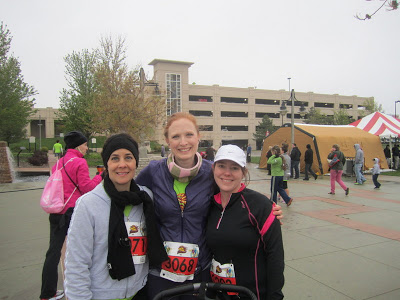
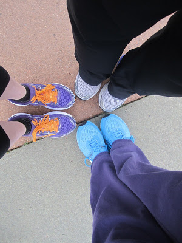
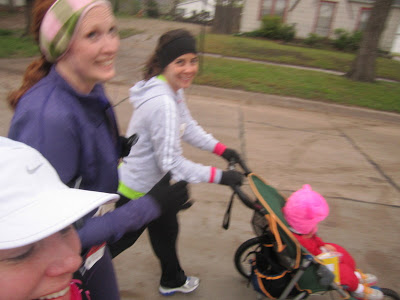
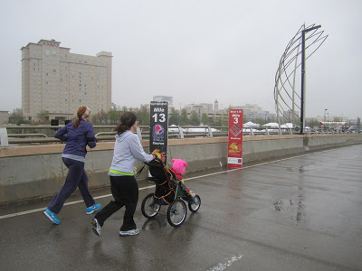
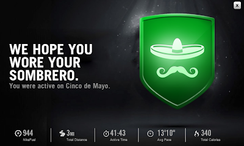
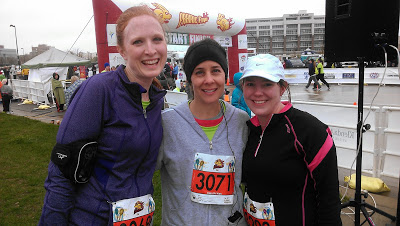

At 2 months postpartum my only goal for racing is to enjoy the experience and have fun with friends. I had originally planned to run the Girls on the Run 5K next weekend but was disappointed to hear some of my friends were not able to run it. Since I am not trying to PR or hit a certain time goal I really wanted to run with friends. Then I found out a few of my other friends were running the Prairie Fire and I decided to sign up too. Perfect!  
  
  

<table align="center" cellpadding="0" cellspacing="0"><tbody><tr><td></td></tr><tr><td><a href="http://www.prairiefiremarathon.com/index.php?option=com_content&amp;view=article&amp;id=30&amp;Itemid=164" target="_blank">Click to find out more about the race series.</a></td></tr></tbody></table>

No, I did not run the half marathon! The 5K was enough for me right now.   
  
The morning of the race we woke up to a light drizzle and cold temperatures, especially for May. It was about 45 degrees but with the wind chill it was in the upper 30's. Not bad for running a half but it was a little chilly for the 5k. Of course, once we got started we were fine and not too cold at all.  
  
My friend, Elizabeth, has been running a Couch 2 5K program and this was her first 5k! I was so excited to run it with her. We also ran with my friend, LeAnn, who pushed her daughter during the race.   
  

  
My entire goal for this race was to stick by Elizabeth's side. She had worked so hard to get to this point and I wanted to be there for moral support. She could do this all by herself but doing it with friends makes it just a little easier.   
  

  
Running with these girls was hilarious. Elizabeth's music was turned up pretty loud so she really couldn't hear what we would say to her. Also, when she talked (or sang!) she did it over her music. Yep, pretty loudly and it was fantastic!   
  
We ran through the first mile a little faster than I expected. That only meant we slowed down a little during the last two. I'm so proud of Elizabeth for RUNNING the whole 3.1 miles! She thought she would have to walk at some point but she toughed it out and ran.   
  

Blurry running self portrait. I tried...at least we are all in the photo!

  
With the finish line in sight, I stuck with Elizabeth while LeAnn stopped to get her daughter out for the finish. Running up to and through the finish line was pretty emotional. All I can say is how proud I am of Elizabeth for having the courage to start the race and the strength to finish it!  
  

  
I can't say that I was too impressed with the actual course of the 5K. Wichita definitely has prettier streets than what we ran on for the race. I guess it's a good thing that I was enjoying my company so much that it didn't really matter where we were running.   
  

  
Nike+ had a fun message for me after I loaded my run. No sombrero today but it was a fabulous Cinco de Mayo!  
  
Official Distance: 5k (3.1 miles)  
Nike+ Distance: 3.16 miles  
Official Time: 41:39  
Nike+ Time: 41:43  
Official Pace: 13:25  
Nike+ Pace: 13:10  
Overall Placement: 300 out of 371  
Age Placement:  24 out of 33  
  
It was fun to run a race with friends. Not worrying about speed but instead enjoying some quality time running with friends. I will definitely do a race with friends again!   
  

  

The finishers!
